# Alur Admin Management
## Flowchart Pengelolaan Sistem oleh Admin

---

## 1. Overview Admin Dashboard

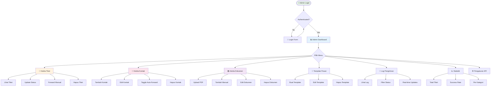
```mermaid
flowchart TD
    Start([🔐 Admin Login]) --> Auth{Authenticated?}
    
    Auth -->|No| Login[📝 Login Form]
    Login --> Auth
    
    Auth -->|Yes| Dashboard[📊 Admin Dashboard]
    
    Dashboard --> Menu{Pilih Menu}
    
    Menu --> A[🎫 Kelola Tiket]
    Menu --> B[📇 Kelola Kontak]
    Menu --> C[📚 Kelola Dokumen]
    Menu --> D[📝 Template Pesan]
    Menu --> E[📜 Log Pengiriman]
    Menu --> F[📈 Statistik]
    Menu --> G[⚙️ Pengaturan API]
    
    A --> A1[Lihat Tiket]
    A --> A2[Update Status]
    A --> A3[Forward Manual]
    A --> A4[Hapus Tiket]
    
    B --> B1[Tambah Kontak]
    B --> B2[Edit Kontak]
    B --> B3[Toggle Auto-Forward]
    B --> B4[Hapus Kontak]
    
    C --> C1[Upload PDF]
    C --> C2[Tambah Manual]
    C --> C3[Edit Dokumen]
    C --> C4[Hapus Dokumen]
    
    D --> D1[Buat Template]
    D --> D2[Edit Template]
    D --> D3[Hapus Template]
    
    E --> E1[Lihat Log]
    E --> E2[Filter Status]
    E --> E3[Real-time Updates]
    
    F --> F1[Total Tiket]
    F --> F2[Success Rate]
    F --> F3[Per Kategori]

    style Start fill:#e8f5e9
    style Dashboard fill:#e3f2fd
    style A fill:#fff3e0
    style B fill:#fce4ec
    style C fill:#f3e5f5
```

---

## 2. Alur Login Admin

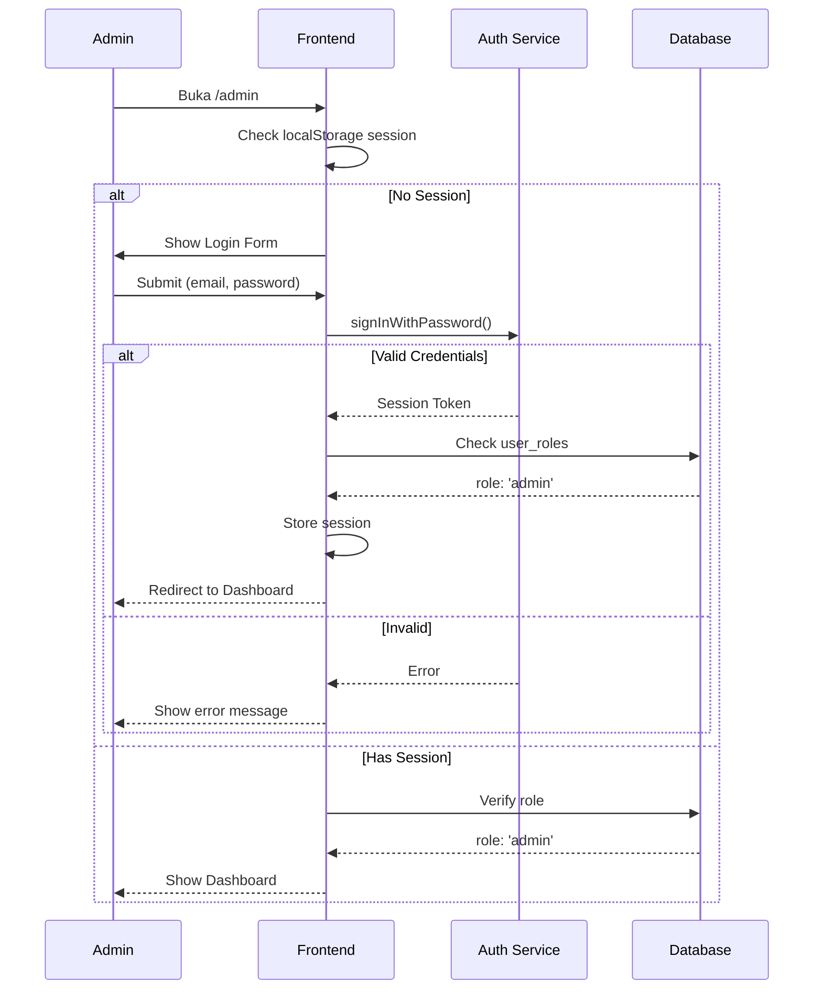
```mermaid
sequenceDiagram
    participant A as Admin
    participant FE as Frontend
    participant Auth as Auth Service
    participant DB as Database
    
    A->>FE: Buka /admin
    FE->>FE: Check localStorage session
    
    alt No Session
        FE->>A: Show Login Form
        A->>FE: Submit (email, password)
        FE->>Auth: signInWithPassword()
        
        alt Valid Credentials
            Auth-->>FE: Session Token
            FE->>DB: Check user_roles
            DB-->>FE: role: 'admin'
            FE->>FE: Store session
            FE-->>A: Redirect to Dashboard
        else Invalid
            Auth-->>FE: Error
            FE-->>A: Show error message
        end
    else Has Session
        FE->>DB: Verify role
        DB-->>FE: role: 'admin'
        FE-->>A: Show Dashboard
    end
```

---

## 3. Alur Kelola Tiket

### 3.1 Lihat & Filter Tiket

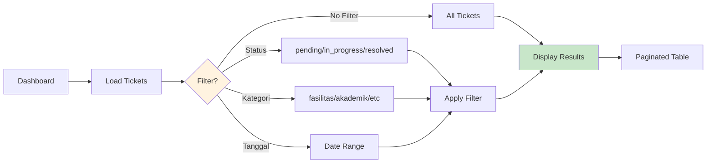
```mermaid
flowchart LR
    A[Dashboard] --> B[Load Tickets]
    B --> C{Filter?}
    
    C -->|Status| D[pending/in_progress/resolved]
    C -->|Kategori| E[fasilitas/akademik/etc]
    C -->|Tanggal| F[Date Range]
    C -->|No Filter| G[All Tickets]
    
    D --> H[Apply Filter]
    E --> H
    F --> H
    G --> I[Display Results]
    H --> I
    
    I --> J[Paginated Table]

    style C fill:#fff3e0
    style I fill:#c8e6c9
```

### 3.2 Update Status Tiket

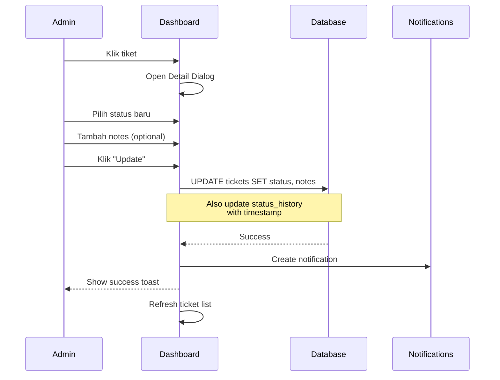
```mermaid
sequenceDiagram
    participant A as Admin
    participant UI as Dashboard
    participant DB as Database
    participant N as Notifications
    
    A->>UI: Klik tiket
    UI->>UI: Open Detail Dialog
    A->>UI: Pilih status baru
    A->>UI: Tambah notes (optional)
    A->>UI: Klik "Update"
    
    UI->>DB: UPDATE tickets SET status, notes
    
    Note over UI,DB: Also update status_history<br/>with timestamp
    
    DB-->>UI: Success
    UI->>N: Create notification
    UI-->>A: Show success toast
    UI->>UI: Refresh ticket list
```

### 3.3 Forward Manual Tiket

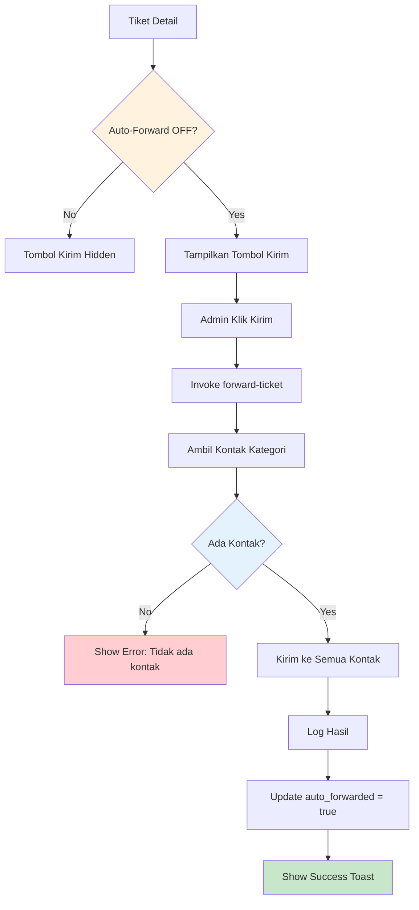
```mermaid
flowchart TD
    A[Tiket Detail] --> B{Auto-Forward OFF?}
    
    B -->|No| C[Tombol Kirim Hidden]
    B -->|Yes| D[Tampilkan Tombol Kirim]
    
    D --> E[Admin Klik Kirim]
    E --> F[Invoke forward-ticket]
    F --> G[Ambil Kontak Kategori]
    G --> H{Ada Kontak?}
    
    H -->|No| I[Show Error: Tidak ada kontak]
    H -->|Yes| J[Kirim ke Semua Kontak]
    
    J --> K[Log Hasil]
    K --> L[Update auto_forwarded = true]
    L --> M[Show Success Toast]
    
    style B fill:#fff3e0
    style H fill:#e3f2fd
    style I fill:#ffcdd2
    style M fill:#c8e6c9
```

---

## 4. Alur Kelola Kontak Forwarding

### 4.1 Tambah Kontak Baru

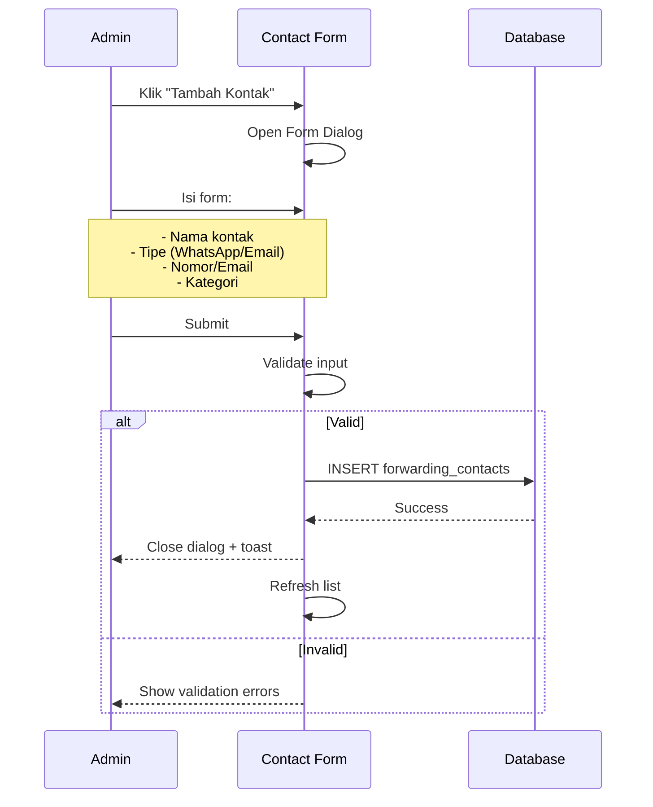
```mermaid
sequenceDiagram
    participant A as Admin
    participant UI as Contact Form
    participant DB as Database
    
    A->>UI: Klik "Tambah Kontak"
    UI->>UI: Open Form Dialog
    
    A->>UI: Isi form:
    Note over A,UI: - Nama kontak<br/>- Tipe (WhatsApp/Email)<br/>- Nomor/Email<br/>- Kategori
    
    A->>UI: Submit
    UI->>UI: Validate input
    
    alt Valid
        UI->>DB: INSERT forwarding_contacts
        DB-->>UI: Success
        UI-->>A: Close dialog + toast
        UI->>UI: Refresh list
    else Invalid
        UI-->>A: Show validation errors
    end
```

### 4.2 Toggle Auto-Forward

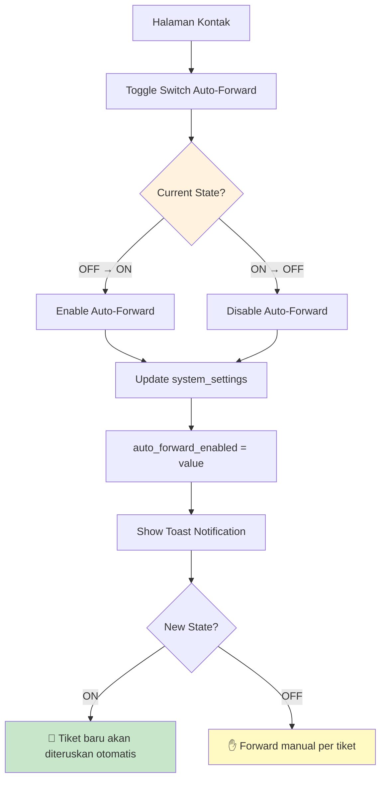
```mermaid
flowchart TD
    A[Halaman Kontak] --> B[Toggle Switch Auto-Forward]
    B --> C{Current State?}
    
    C -->|OFF → ON| D[Enable Auto-Forward]
    C -->|ON → OFF| E[Disable Auto-Forward]
    
    D --> F[Update system_settings]
    E --> F
    
    F --> G[auto_forward_enabled = value]
    G --> H[Show Toast Notification]
    
    H --> I{New State?}
    I -->|ON| J[📧 Tiket baru akan diteruskan otomatis]
    I -->|OFF| K[✋ Forward manual per tiket]

    style C fill:#fff3e0
    style J fill:#c8e6c9
    style K fill:#fff9c4
```

### 4.3 Daftar Kontak per Kategori

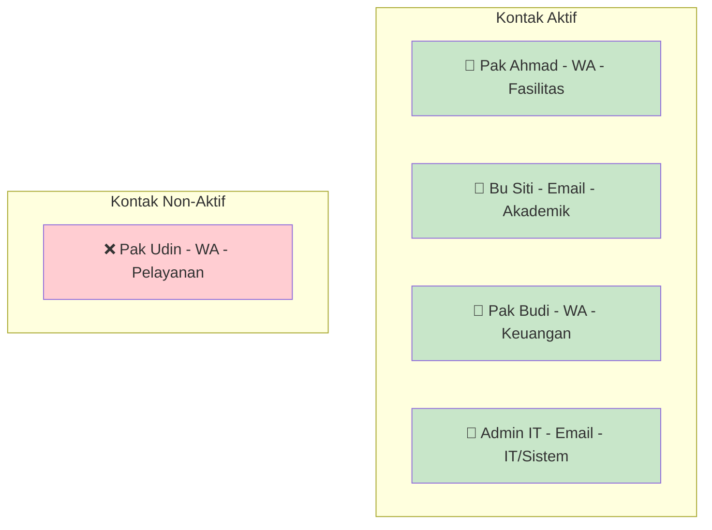
```mermaid
graph TB
    subgraph "Kontak Aktif"
        A1[📱 Pak Ahmad - WA - Fasilitas]
        A2[📧 Bu Siti - Email - Akademik]
        A3[📱 Pak Budi - WA - Keuangan]
        A4[📧 Admin IT - Email - IT/Sistem]
    end
    
    subgraph "Kontak Non-Aktif"
        B1[❌ Pak Udin - WA - Pelayanan]
    end
    
    style A1 fill:#c8e6c9
    style A2 fill:#c8e6c9
    style A3 fill:#c8e6c9
    style A4 fill:#c8e6c9
    style B1 fill:#ffcdd2
```

---

## 5. Alur Kelola Dokumen Kampus

### 5.1 Upload PDF

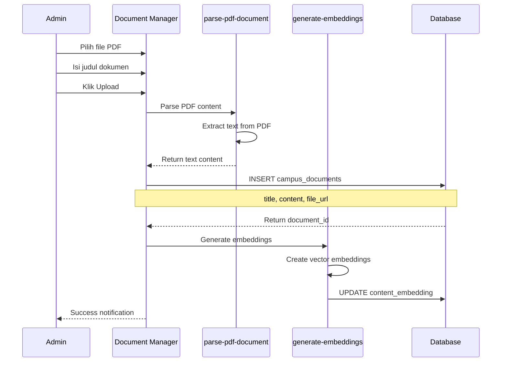
```mermaid
sequenceDiagram
    participant A as Admin
    participant UI as Document Manager
    participant EF as parse-pdf-document
    participant EMB as generate-embeddings
    participant DB as Database
    
    A->>UI: Pilih file PDF
    A->>UI: Isi judul dokumen
    A->>UI: Klik Upload
    
    UI->>EF: Parse PDF content
    EF->>EF: Extract text from PDF
    EF-->>UI: Return text content
    
    UI->>DB: INSERT campus_documents
    Note over UI,DB: title, content, file_url
    DB-->>UI: Return document_id
    
    UI->>EMB: Generate embeddings
    EMB->>EMB: Create vector embeddings
    EMB->>DB: UPDATE content_embedding
    
    UI-->>A: Success notification
```

### 5.2 Tambah Dokumen Manual

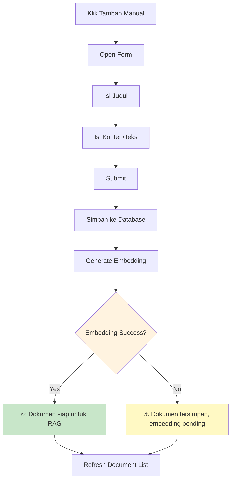
```mermaid
flowchart TD
    A[Klik Tambah Manual] --> B[Open Form]
    B --> C[Isi Judul]
    C --> D[Isi Konten/Teks]
    D --> E[Submit]
    
    E --> F[Simpan ke Database]
    F --> G[Generate Embedding]
    G --> H{Embedding Success?}
    
    H -->|Yes| I[✅ Dokumen siap untuk RAG]
    H -->|No| J[⚠️ Dokumen tersimpan, embedding pending]
    
    I --> K[Refresh Document List]
    J --> K

    style H fill:#fff3e0
    style I fill:#c8e6c9
    style J fill:#fff9c4
```

---

## 6. Alur Log Pengiriman

### 6.1 View & Filter Logs

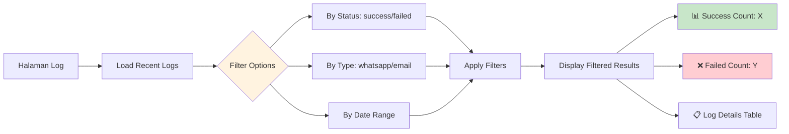
```mermaid
flowchart LR
    A[Halaman Log] --> B[Load Recent Logs]
    B --> C{Filter Options}
    
    C --> D[By Status: success/failed]
    C --> E[By Type: whatsapp/email]
    C --> F[By Date Range]
    
    D --> G[Apply Filters]
    E --> G
    F --> G
    
    G --> H[Display Filtered Results]
    
    H --> I[📊 Success Count: X]
    H --> J[❌ Failed Count: Y]
    H --> K[📋 Log Details Table]

    style C fill:#fff3e0
    style I fill:#c8e6c9
    style J fill:#ffcdd2
```

### 6.2 Real-time Log Updates

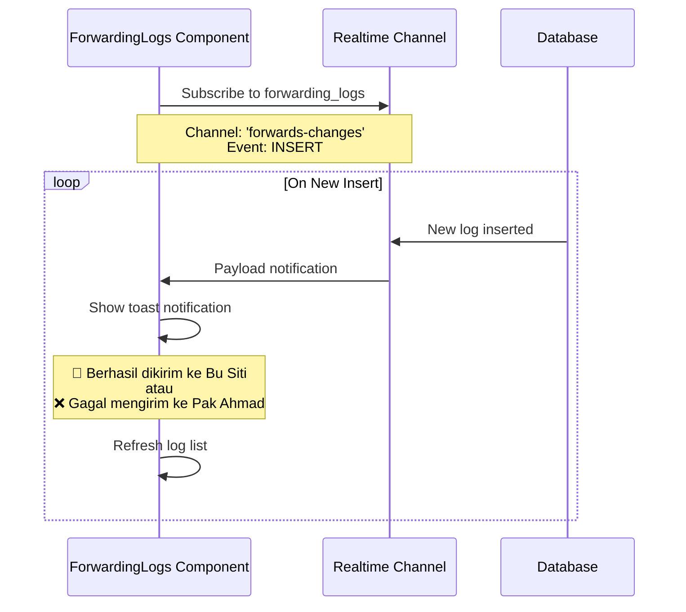
```mermaid
sequenceDiagram
    participant UI as ForwardingLogs Component
    participant RT as Realtime Channel
    participant DB as Database
    
    UI->>RT: Subscribe to forwarding_logs
    Note over UI,RT: Channel: 'forwards-changes'<br/>Event: INSERT
    
    loop On New Insert
        DB->>RT: New log inserted
        RT->>UI: Payload notification
        UI->>UI: Show toast notification
        Note over UI: 📧 Berhasil dikirim ke Bu Siti<br/>atau<br/>❌ Gagal mengirim ke Pak Ahmad
        UI->>UI: Refresh log list
    end
```

---

## 7. Alur Statistik & Analytics

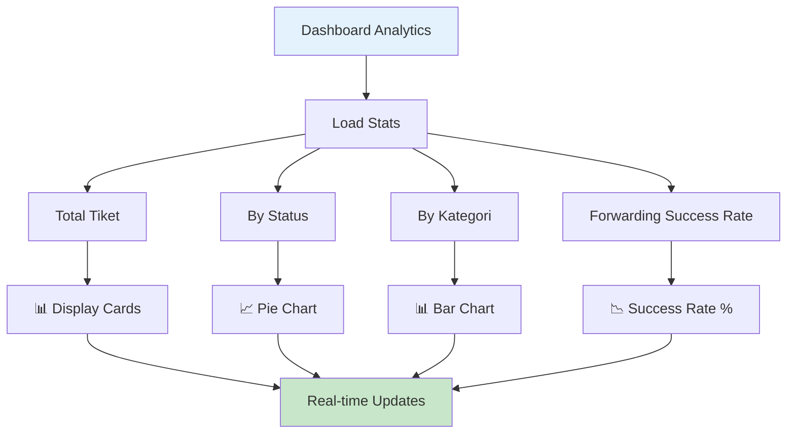
```mermaid
flowchart TD
    A[Dashboard Analytics] --> B[Load Stats]
    
    B --> C[Total Tiket]
    B --> D[By Status]
    B --> E[By Kategori]
    B --> F[Forwarding Success Rate]
    
    C --> G[📊 Display Cards]
    D --> H[📈 Pie Chart]
    E --> I[📊 Bar Chart]
    F --> J[📉 Success Rate %]
    
    G --> K[Real-time Updates]
    H --> K
    I --> K
    J --> K

    style A fill:#e3f2fd
    style K fill:#c8e6c9
```

**Metrics Dashboard:**

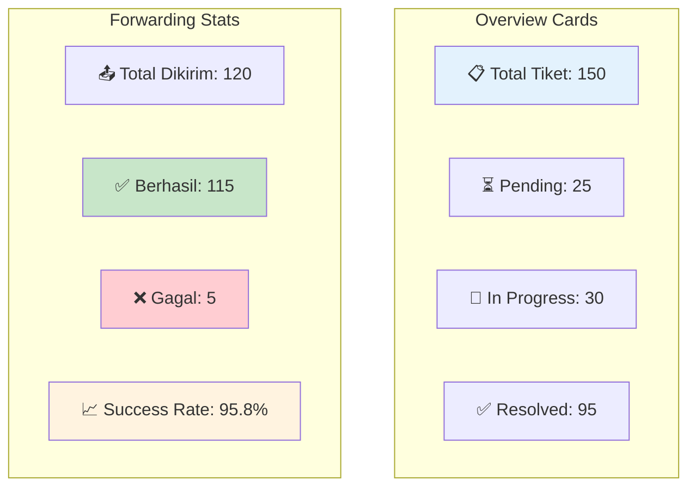
```mermaid
graph TB
    subgraph "Overview Cards"
        A[📋 Total Tiket: 150]
        B[⏳ Pending: 25]
        C[🔄 In Progress: 30]
        D[✅ Resolved: 95]
    end
    
    subgraph "Forwarding Stats"
        E[📤 Total Dikirim: 120]
        F[✅ Berhasil: 115]
        G[❌ Gagal: 5]
        H[📈 Success Rate: 95.8%]
    end
    
    style A fill:#e3f2fd
    style F fill:#c8e6c9
    style G fill:#ffcdd2
    style H fill:#fff3e0
```

---

## 8. Alur Pengaturan API

### 8.1 Konfigurasi API Keys

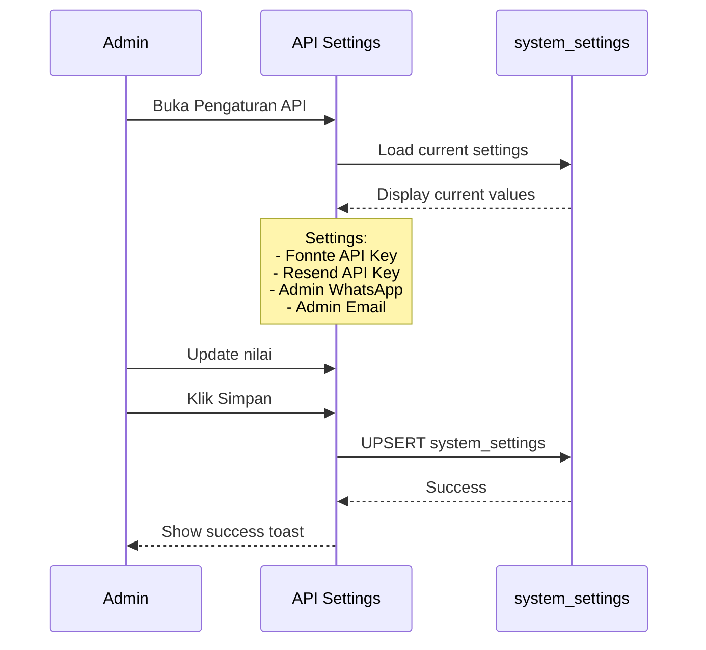
```mermaid
sequenceDiagram
    participant A as Admin
    participant UI as API Settings
    participant DB as system_settings
    
    A->>UI: Buka Pengaturan API
    UI->>DB: Load current settings
    DB-->>UI: Display current values
    
    Note over UI: Settings:<br/>- Fonnte API Key<br/>- Resend API Key<br/>- Admin WhatsApp<br/>- Admin Email
    
    A->>UI: Update nilai
    A->>UI: Klik Simpan
    
    UI->>DB: UPSERT system_settings
    DB-->>UI: Success
    UI-->>A: Show success toast
```

### 8.2 Test API Connection

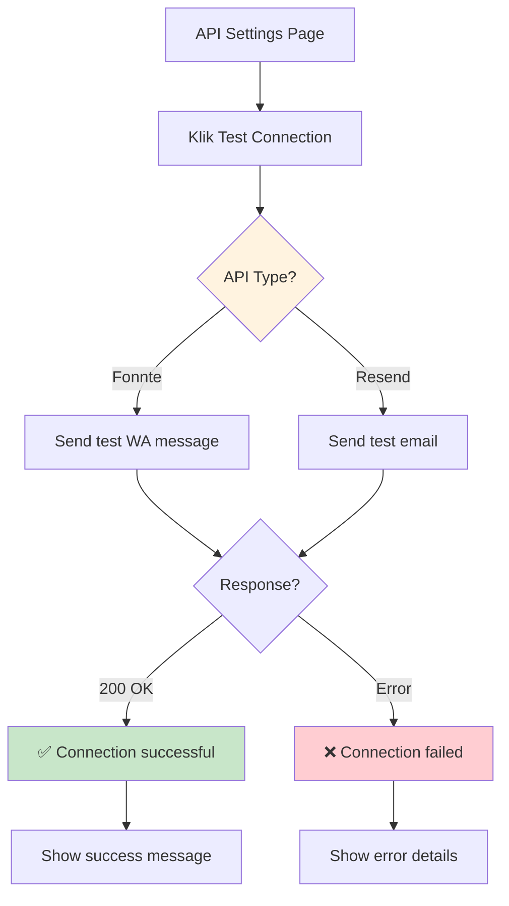
```mermaid
flowchart TD
    A[API Settings Page] --> B[Klik Test Connection]
    B --> C{API Type?}
    
    C -->|Fonnte| D[Send test WA message]
    C -->|Resend| E[Send test email]
    
    D --> F{Response?}
    E --> F
    
    F -->|200 OK| G[✅ Connection successful]
    F -->|Error| H[❌ Connection failed]
    
    G --> I[Show success message]
    H --> J[Show error details]

    style C fill:#fff3e0
    style G fill:#c8e6c9
    style H fill:#ffcdd2
```

---

## 9. Role-Based Access Control

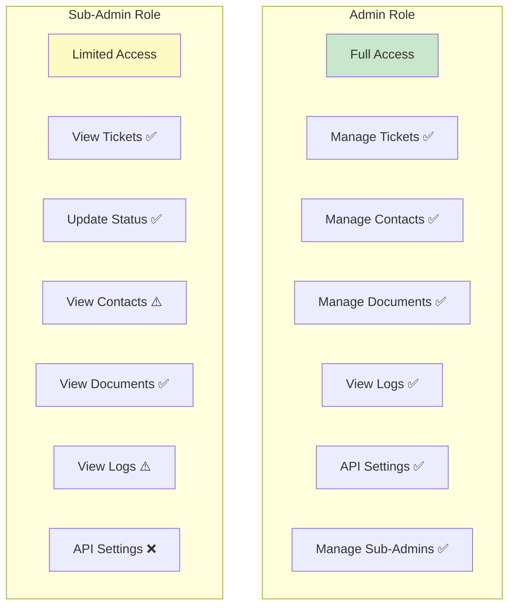
```mermaid
graph TB
    subgraph "Admin Role"
        A1[Full Access]
        A2[Manage Tickets ✅]
        A3[Manage Contacts ✅]
        A4[Manage Documents ✅]
        A5[View Logs ✅]
        A6[API Settings ✅]
        A7[Manage Sub-Admins ✅]
    end
    
    subgraph "Sub-Admin Role"
        B1[Limited Access]
        B2[View Tickets ✅]
        B3[Update Status ✅]
        B4[View Contacts ⚠️]
        B5[View Documents ✅]
        B6[View Logs ⚠️]
        B7[API Settings ❌]
    end
    
    style A1 fill:#c8e6c9
    style B1 fill:#fff9c4
```

---

## 10. Notification Flow

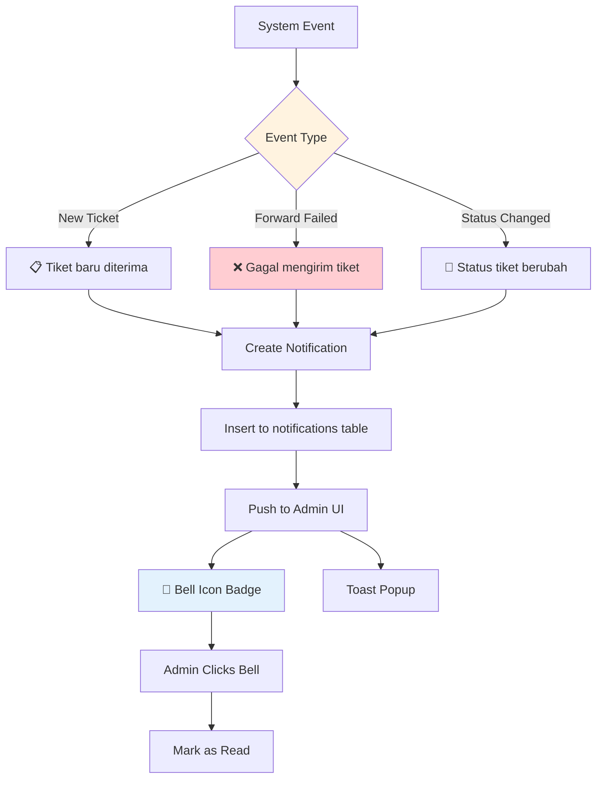
```mermaid
flowchart TD
    A[System Event] --> B{Event Type}
    
    B -->|New Ticket| C[📋 Tiket baru diterima]
    B -->|Forward Failed| D[❌ Gagal mengirim tiket]
    B -->|Status Changed| E[🔄 Status tiket berubah]
    
    C --> F[Create Notification]
    D --> F
    E --> F
    
    F --> G[Insert to notifications table]
    G --> H[Push to Admin UI]
    H --> I[🔔 Bell Icon Badge]
    H --> J[Toast Popup]
    
    I --> K[Admin Clicks Bell]
    K --> L[Mark as Read]

    style B fill:#fff3e0
    style D fill:#ffcdd2
    style I fill:#e3f2fd
```

---

## 11. Admin Activity Timeline

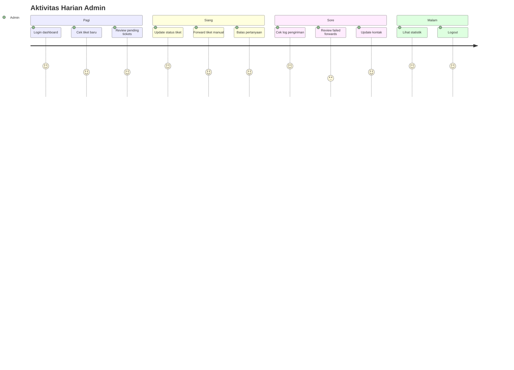
```mermaid
journey
    title Aktivitas Harian Admin
    section Pagi
      Login dashboard: 5: Admin
      Cek tiket baru: 4: Admin
      Review pending tickets: 4: Admin
    section Siang
      Update status tiket: 5: Admin
      Forward tiket manual: 4: Admin
      Balas pertanyaan: 4: Admin
    section Sore
      Cek log pengiriman: 5: Admin
      Review failed forwards: 3: Admin
      Update kontak: 4: Admin
    section Malam
      Lihat statistik: 5: Admin
      Logout: 5: Admin
```

---

*Dokumentasi Alur Admin untuk Sistem Chatbot Pelayanan Keluhan Kampus*
