# Alur User Meminta Informasi
## Flowchart RAG (Retrieval-Augmented Generation) System

---

## 1. Flowchart Utama RAG

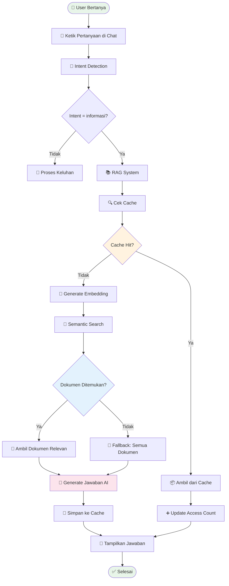

---

## 2. Komponen RAG System

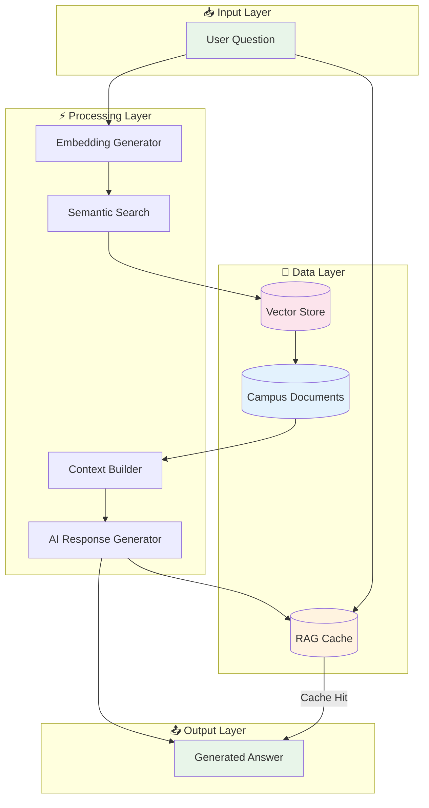

---

## 3. Detail Proses Caching

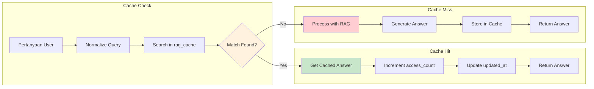

**Struktur Cache:**
```typescript
interface RagCache {
  id: string;
  question: string;      // Pertanyaan original
  answer: string;        // Jawaban yang di-cache
  documents_used: number; // Jumlah dokumen yang digunakan
  access_count: number;   // Berapa kali diakses
  created_at: Date;
  updated_at: Date;
}
```

---

## 4. Detail Proses Embedding

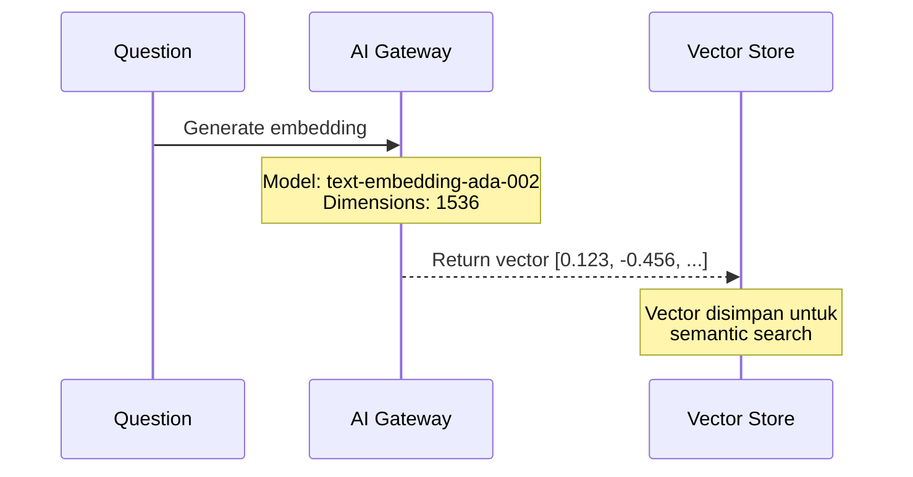

**Embedding Process:**
```typescript
// Generate embedding untuk pertanyaan
const embeddingResponse = await fetch(aiGatewayUrl, {
  method: 'POST',
  body: JSON.stringify({
    model: 'openai/gpt-4o-mini',
    messages: [{
      role: 'user',
      content: `Generate semantic embedding for: "${question}"`
    }]
  })
});
```

---

## 5. Detail Semantic Search

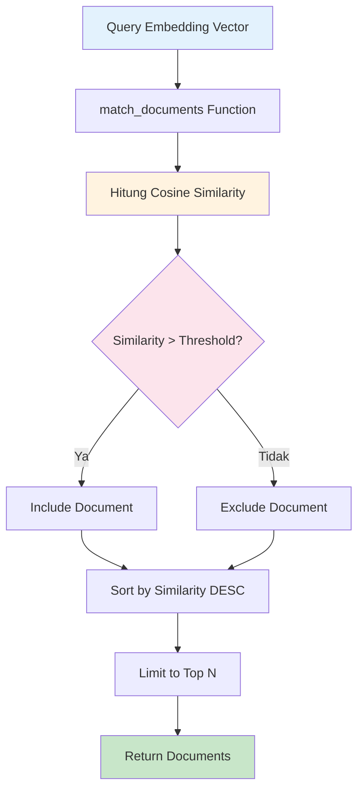

**SQL Function match_documents:**
```sql
CREATE FUNCTION match_documents(
  query_embedding vector(1536),
  match_threshold float DEFAULT 0.7,
  match_count int DEFAULT 5
)
RETURNS TABLE (
  id uuid,
  title text,
  content text,
  similarity float
) AS $$
  SELECT 
    campus_documents.id,
    campus_documents.title,
    campus_documents.content,
    1 - (campus_documents.content_embedding <=> query_embedding) as similarity
  FROM campus_documents
  WHERE content_embedding IS NOT NULL
    AND 1 - (content_embedding <=> query_embedding) > match_threshold
  ORDER BY similarity DESC
  LIMIT match_count;
$$ LANGUAGE sql STABLE;
```

---

## 6. Detail Context Building

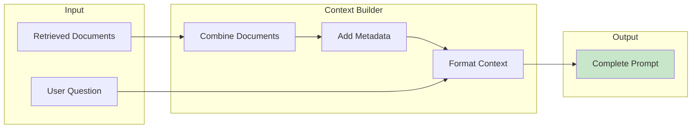

**Context Template:**
```
Anda adalah asisten virtual UIN Alauddin Makassar.
Jawab pertanyaan berdasarkan dokumen berikut:

=== DOKUMEN RELEVAN ===

[Dokumen 1: {title}]
{content}

[Dokumen 2: {title}]
{content}

...

=== PERTANYAAN ===
{user_question}

=== INSTRUKSI ===
- Jawab dengan bahasa Indonesia yang baik
- Berdasarkan HANYA pada dokumen di atas
- Jika tidak ada informasi, katakan "Maaf, informasi tidak tersedia"
- Berikan jawaban yang jelas dan ringkas
```

---

## 7. Detail AI Response Generation

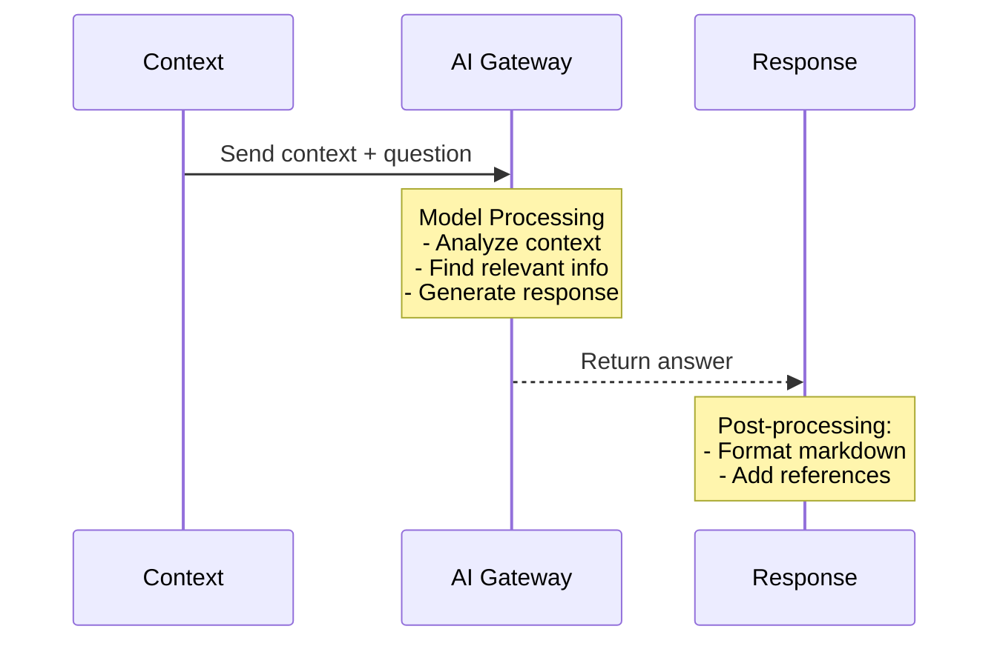

**AI Configuration:**
```typescript
const response = await fetch(aiGatewayUrl, {
  method: 'POST',
  body: JSON.stringify({
    model: 'google/gemini-2.5-flash',
    messages: [
      {
        role: 'system',
        content: systemPrompt
      },
      {
        role: 'user',
        content: contextWithQuestion
      }
    ],
    temperature: 0.3, // Lower for factual responses
    max_tokens: 1000
  })
});
```

---

## 8. Fallback Strategy

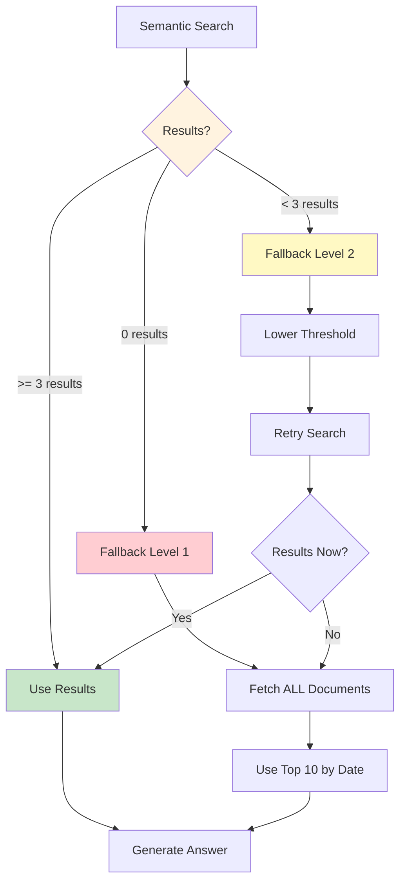

**Fallback Logic:**
```typescript
// Level 1: Lower threshold
let documents = await semanticSearch(embedding, 0.7);

if (documents.length < 3) {
  // Level 2: Much lower threshold
  documents = await semanticSearch(embedding, 0.5);
}

if (documents.length === 0) {
  // Level 3: Get all documents
  documents = await getAllDocuments();
}
```

---

## 9. Document Management for RAG

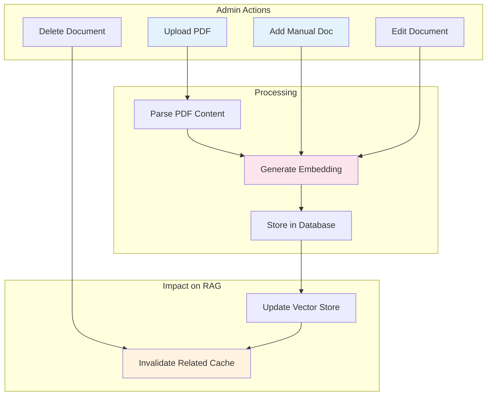

---

## 10. Performance Optimizations

### 10.1 Caching Layer

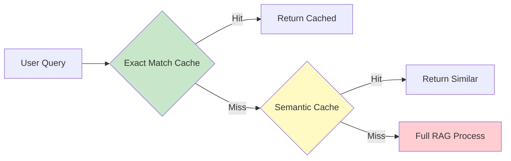

### 10.2 Metrics Tracked

| Metric | Description |
|--------|-------------|
| `cache_hit_rate` | Persentase cache hit |
| `avg_response_time` | Rata-rata waktu respons |
| `documents_searched` | Jumlah dokumen yang di-search |
| `embedding_time` | Waktu generate embedding |
| `similarity_scores` | Distribusi similarity scores |

---

## 11. Example Flow

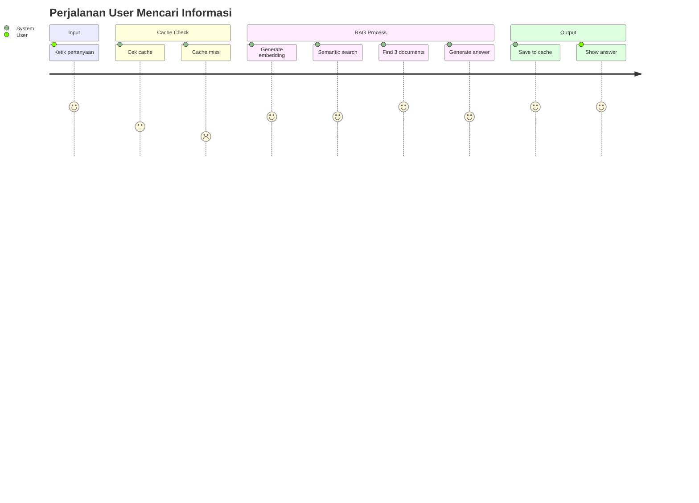

**Contoh Interaksi:**

**User:** "Bagaimana cara mengurus cuti akademik?"

**System Process:**
1. ✅ Intent detected: "informasi"
2. ❌ Cache miss
3. ✅ Embedding generated
4. ✅ Found 3 relevant documents:
   - "Panduan Cuti Akademik.pdf" (similarity: 0.89)
   - "Peraturan Akademik 2024.pdf" (similarity: 0.82)
   - "FAQ Mahasiswa.pdf" (similarity: 0.78)
5. ✅ Answer generated
6. ✅ Saved to cache

**Response:**
```
Untuk mengurus cuti akademik di UIN Alauddin Makassar, 
ikuti langkah berikut:

1. Download formulir cuti di portal akademik
2. Isi formulir dan lampirkan:
   - Fotokopi KTM
   - Surat permohonan bermaterai
   - Bukti pembayaran UKT terakhir
3. Ajukan ke bagian akademik fakultas
4. Tunggu persetujuan (3-5 hari kerja)

Informasi ini berdasarkan Panduan Cuti Akademik 
dan Peraturan Akademik 2024.
```

---

## 12. Error Handling

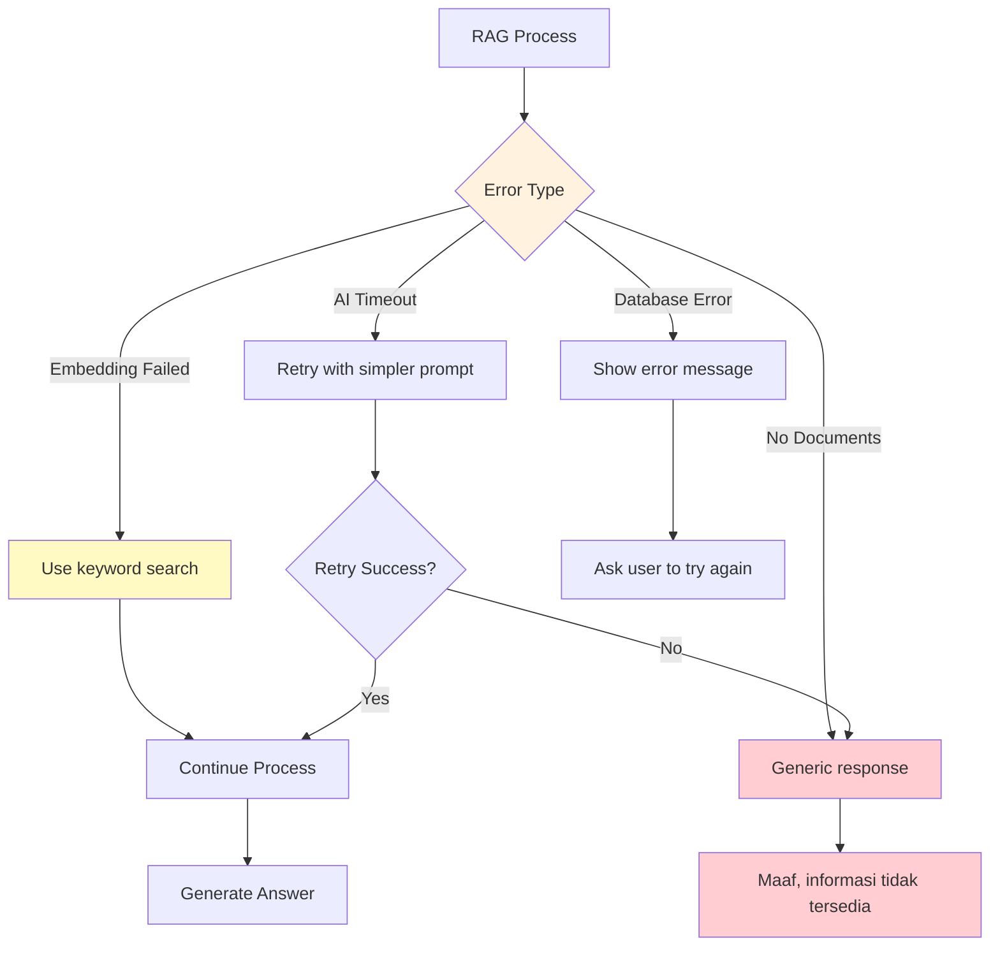

---

*Dokumentasi Alur Informasi (RAG) untuk Sistem Chatbot Pelayanan Keluhan Kampus*
