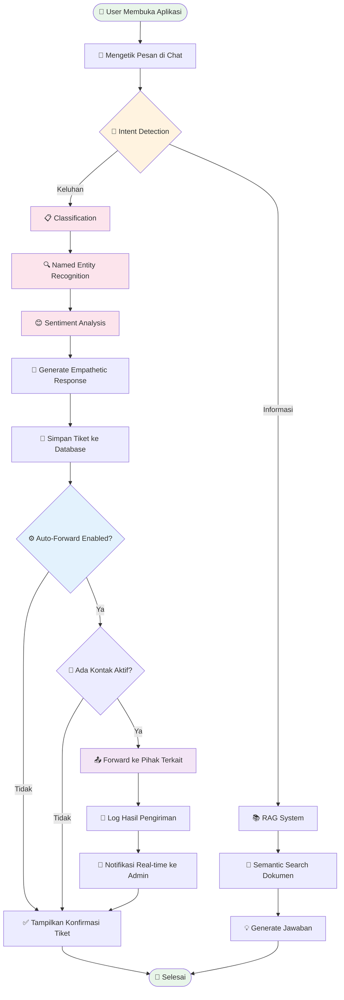
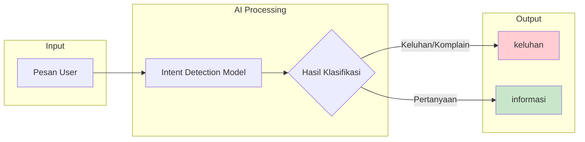
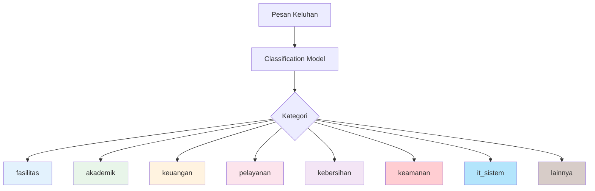
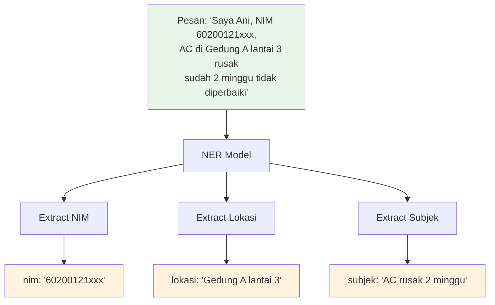
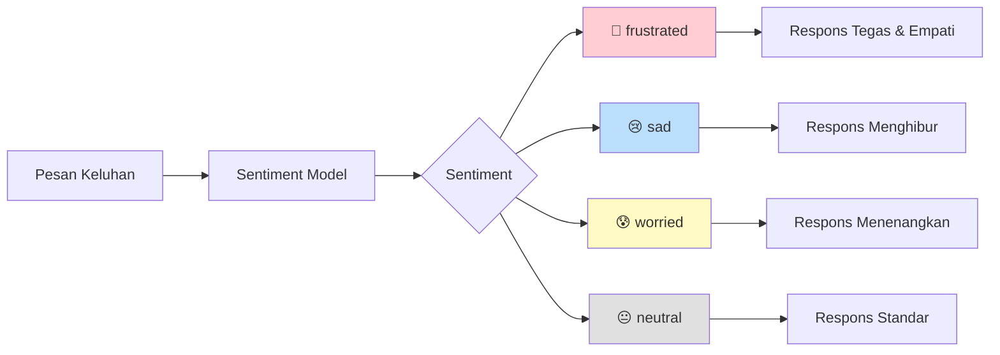
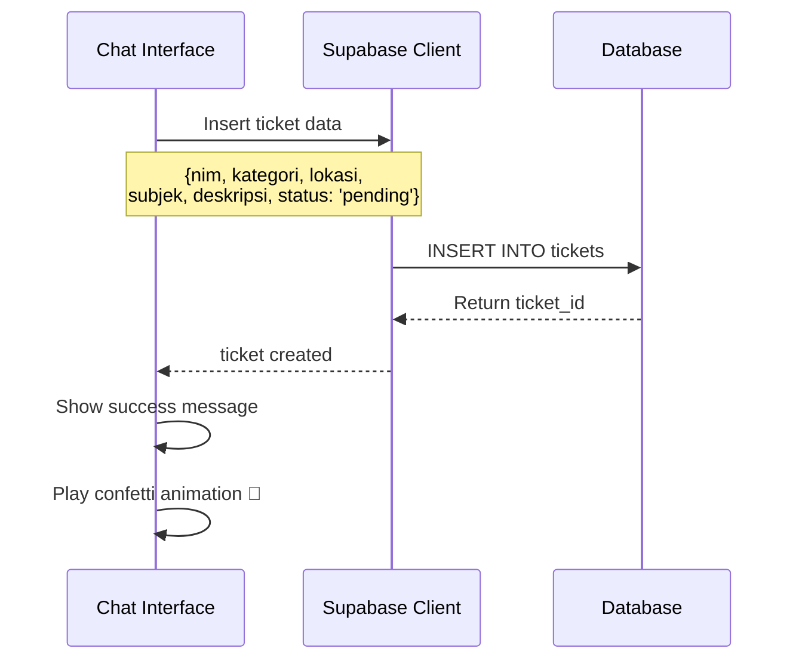
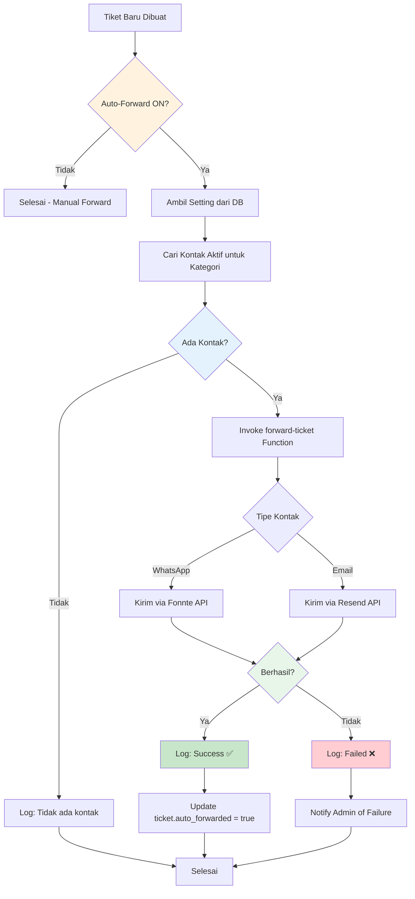
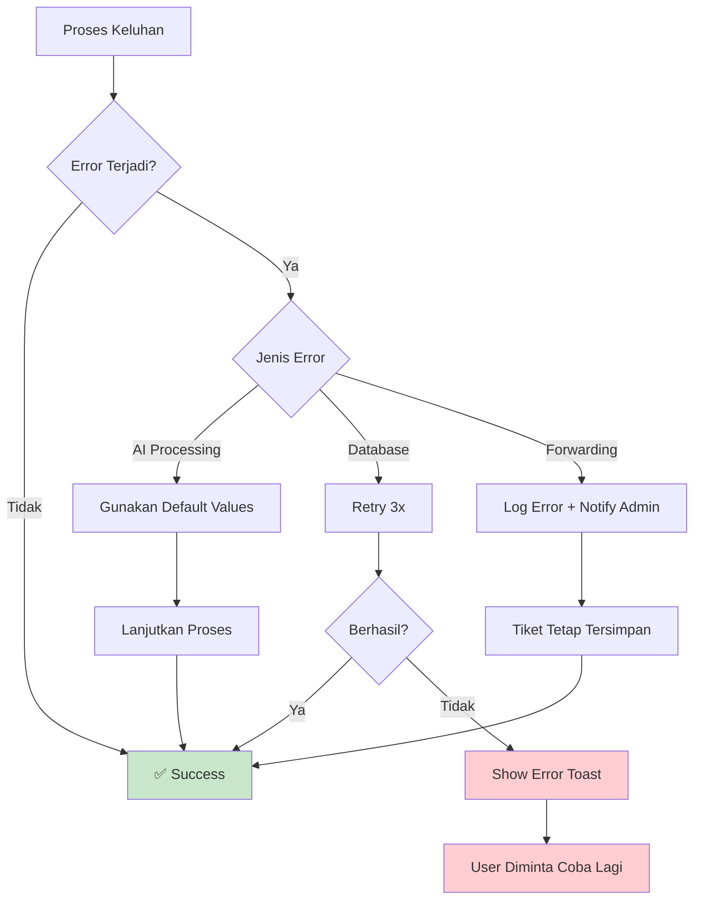
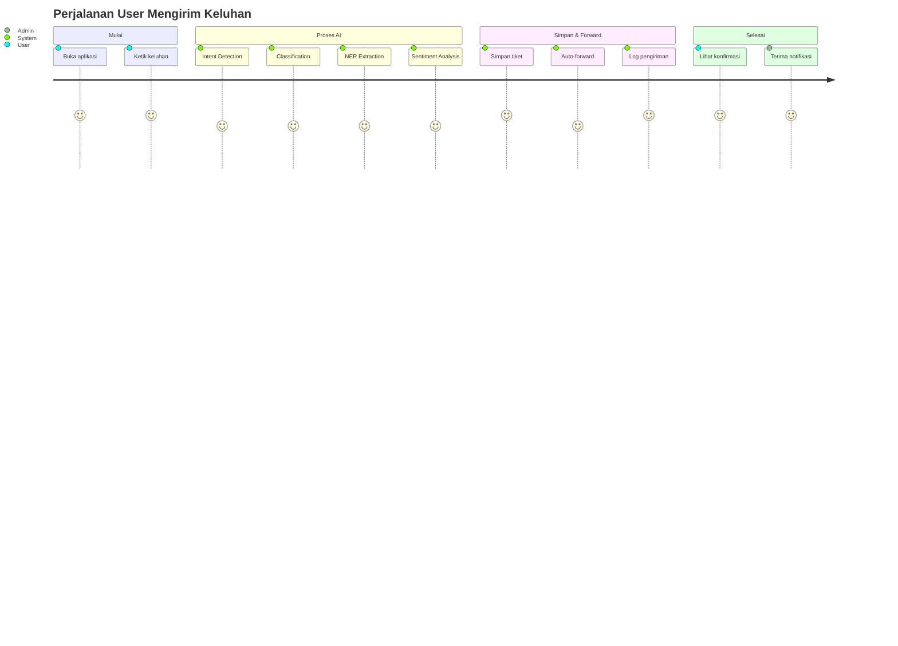

# Alur User Mengirim Keluhan
## Flowchart Detail Proses Keluhan

---

## 1. Flowchart Utama



---

## 2. Detail Proses Intent Detection



**Prompt yang digunakan:**
```
Klasifikasikan pesan berikut sebagai "keluhan" atau "informasi".
- "keluhan": jika user menyampaikan masalah, komplain, atau ketidakpuasan
- "informasi": jika user bertanya atau meminta informasi

Pesan: "{message}"
Jawab hanya dengan satu kata: "keluhan" atau "informasi"
```

---

## 3. Detail Proses Classification



**Kategori dan Deskripsi:**

| Kategori | Deskripsi | Contoh Keluhan |
|----------|-----------|----------------|
| `fasilitas` | Masalah infrastruktur fisik | "AC di ruang kuliah rusak" |
| `akademik` | Masalah perkuliahan | "Jadwal ujian bentrok" |
| `keuangan` | Masalah pembayaran | "Tagihan UKT salah" |
| `pelayanan` | Kualitas layanan | "Staff tidak ramah" |
| `kebersihan` | Kebersihan lingkungan | "Toilet sangat kotor" |
| `keamanan` | Masalah keamanan | "Motor hilang di parkiran" |
| `it_sistem` | Masalah teknologi | "Portal akademik error" |
| `lainnya` | Kategori umum | Keluhan lain-lain |

---

## 4. Detail Proses Named Entity Recognition (NER)



**Prompt NER:**
```
Ekstrak informasi berikut dari pesan keluhan:
1. NIM (Nomor Induk Mahasiswa) - format: 8-15 digit
2. Lokasi kejadian
3. Ringkasan subjek keluhan (maksimal 10 kata)

Pesan: "{message}"

Format output JSON:
{"nim": "...", "lokasi": "...", "subjek": "..."}
```

---

## 5. Detail Proses Sentiment Analysis



**Respons Empatik Berdasarkan Sentiment:**

| Sentiment | Karakteristik | Contoh Respons |
|-----------|---------------|----------------|
| `frustrated` | Marah, kecewa berat | "Kami sangat memahami kekesalan Anda. Masalah ini akan kami prioritaskan." |
| `sad` | Sedih, kecewa | "Kami turut prihatin dengan situasi ini. Kami akan berusaha membantu." |
| `worried` | Khawatir, cemas | "Kami memahami kekhawatiran Anda. Tenang, masalah ini akan kami tangani." |
| `neutral` | Netral, biasa | "Terima kasih telah melaporkan. Kami akan segera menindaklanjuti." |

---

## 6. Proses Penyimpanan Tiket



**Data yang Disimpan:**
```typescript
{
  nim: string,           // Dari NER
  kategori: string,      // Dari Classification
  lokasi: string,        // Dari NER
  subjek: string,        // Dari NER
  deskripsi: string,     // Pesan asli user
  status: 'pending',     // Default status
  is_anonymous: boolean, // Flag anonim
  auto_forwarded: false  // Akan diupdate jika di-forward
}
```

---

## 7. Proses Auto-Forward



---

## 8. Format Pesan Forward

### 8.1 Format WhatsApp

```
🎫 *TIKET KELUHAN BARU*
━━━━━━━━━━━━━━━━━━━━

📋 *Kategori:* {kategori}
📍 *Lokasi:* {lokasi}
👤 *NIM:* {nim}

📝 *Subjek:*
{subjek}

📄 *Deskripsi:*
{deskripsi}

━━━━━━━━━━━━━━━━━━━━
⏰ {waktu}
🔗 Single Gateway UIN Alauddin
```

### 8.2 Format Email

```html
Subject: [Tiket #{id}] Keluhan Baru - {kategori}

<h2>🎫 Tiket Keluhan Baru</h2>

<table>
  <tr><td><b>Kategori:</b></td><td>{kategori}</td></tr>
  <tr><td><b>Lokasi:</b></td><td>{lokasi}</td></tr>
  <tr><td><b>NIM:</b></td><td>{nim}</td></tr>
  <tr><td><b>Waktu:</b></td><td>{waktu}</td></tr>
</table>

<h3>Subjek</h3>
<p>{subjek}</p>

<h3>Deskripsi</h3>
<p>{deskripsi}</p>

<hr>
<p><i>Dikirim otomatis oleh Single Gateway UIN Alauddin Makassar</i></p>
```

---

## 9. Diagram State Tiket

```mermaid
stateDiagram-v2
    [*] --> pending: Tiket Dibuat
    
    pending --> in_progress: Admin Proses
    pending --> forwarded: Auto-Forward
    
    in_progress --> forwarded: Forward Manual
    in_progress --> resolved: Selesai
    
    forwarded --> in_progress: Admin Follow-up
    forwarded --> resolved: Selesai
    
    resolved --> [*]
    
    note right of pending
        Status awal semua tiket baru
    end note
    
    note right of forwarded
        Sudah diteruskan ke 
        pihak terkait
    end note
    
    note right of resolved
        Masalah telah 
        diselesaikan
    end note
```



---

## 10. Error Handling



**Default Values jika AI Gagal:**
- `kategori`: "lainnya"
- `nim`: "tidak terdeteksi"
- `lokasi`: "tidak disebutkan"
- `subjek`: 50 karakter pertama dari pesan

---

## 11. Ringkasan Alur



---

*Dokumentasi Alur Keluhan untuk Sistem Chatbot Pelayanan Keluhan Kampus*
