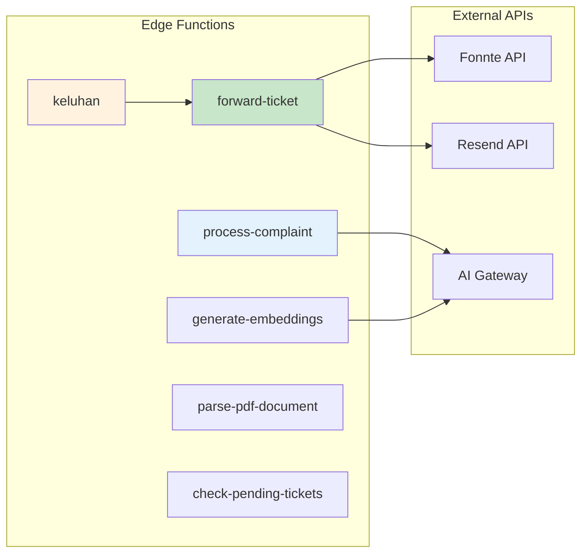
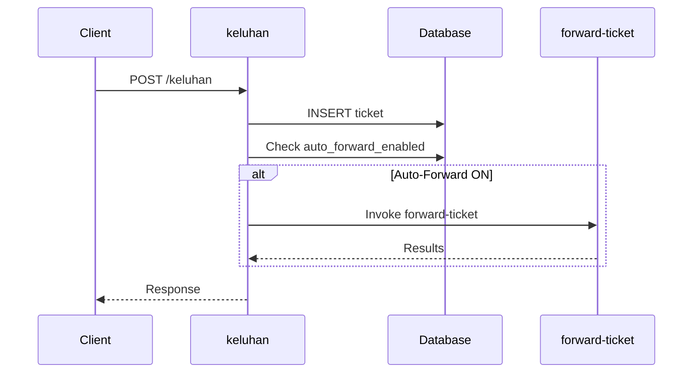
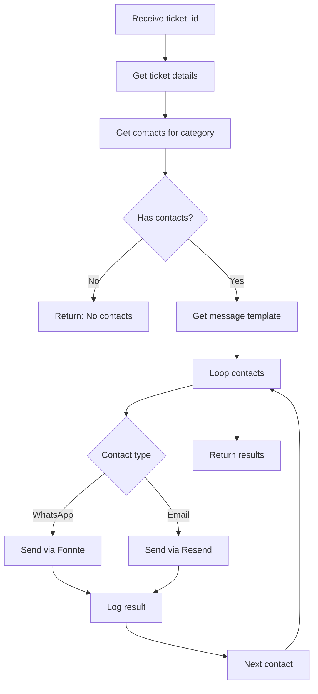
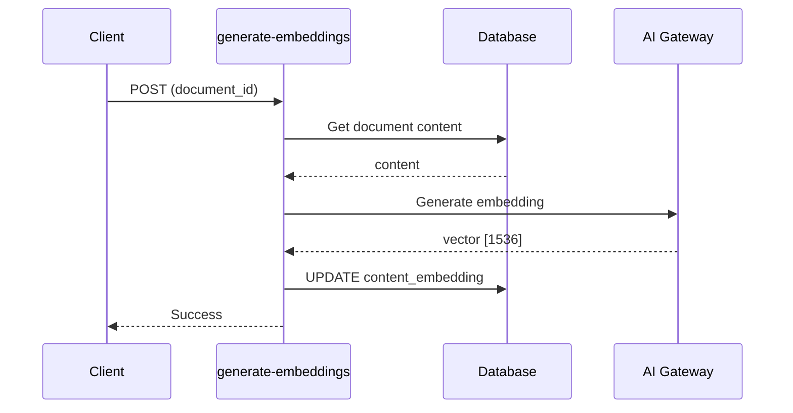

# API Reference
## Dokumentasi Edge Functions

---

## 1. Overview API



---

## 2. process-complaint

AI processing untuk keluhan dan informasi.

### Base URL
```
POST /functions/v1/process-complaint
```

### Headers
```json
{
  "Content-Type": "application/json",
  "Authorization": "Bearer {anon_key}"
}
```

### Request Types

#### 2.1 Intent Detection

```typescript
// Request
{
  "message": "AC di ruang kuliah rusak",
  "type": "intent"
}

// Response
{
  "intent": "keluhan" | "informasi"
}
```

#### 2.2 Classification

```typescript
// Request
{
  "message": "AC di ruang kuliah rusak",
  "type": "classify"
}

// Response
{
  "kategori": "fasilitas" | "akademik" | "keuangan" | "pelayanan" | 
              "kebersihan" | "keamanan" | "it_sistem" | "lainnya"
}
```

#### 2.3 Named Entity Recognition

```typescript
// Request
{
  "message": "Saya Ani NIM 60200121xxx, AC di Gedung A rusak",
  "type": "ner"
}

// Response
{
  "nim": "60200121xxx",
  "lokasi": "Gedung A",
  "subjek": "AC rusak"
}
```

#### 2.4 Sentiment Analysis

```typescript
// Request
{
  "message": "Saya sangat kecewa dengan pelayanan!",
  "type": "sentiment"
}

// Response
{
  "sentiment": "frustrated" | "sad" | "worried" | "neutral"
}
```

#### 2.5 Empathetic Response

```typescript
// Request
{
  "message": "original complaint",
  "type": "empathetic_response",
  "sentiment": "frustrated",
  "kategori": "fasilitas"
}

// Response
{
  "response": "Kami sangat memahami kekesalan Anda..."
}
```

#### 2.6 RAG (Retrieval-Augmented Generation)

```typescript
// Request
{
  "message": "Bagaimana cara mengurus cuti akademik?",
  "type": "rag"
}

// Response
{
  "answer": "Untuk mengurus cuti akademik...",
  "from_cache": false,
  "documents_used": 3
}
```

### Error Response

```typescript
{
  "error": "Error message description"
}
```

---

## 3. keluhan

Endpoint untuk submit keluhan baru.

### Base URL
```
POST /functions/v1/keluhan
```

### Request

```typescript
{
  "nim": "60200121xxx",
  "kategori": "fasilitas",
  "lokasi": "Gedung A Lantai 3",
  "subjek": "AC Rusak",
  "deskripsi": "AC di ruang kuliah 301 tidak berfungsi sejak 2 minggu lalu"
}
```

### Response

```typescript
// Success
{
  "success": true,
  "message": "Keluhan berhasil diterima",
  "ticket_id": "uuid-here",
  "forwarding_results": [
    {
      "contact": "Pak Ahmad",
      "type": "whatsapp",
      "status": "success"
    }
  ]
}

// Error
{
  "success": false,
  "error": "Missing required fields"
}
```

### Flow Diagram



---

## 4. forward-ticket

Forward tiket ke kontak terkait via WhatsApp/Email.

### Base URL
```
POST /functions/v1/forward-ticket
```

### Request

```typescript
{
  "ticket_id": "uuid-here"
}
```

### Response

```typescript
{
  "success": true,
  "results": [
    {
      "contact_name": "Pak Ahmad",
      "contact_type": "whatsapp",
      "status": "success"
    },
    {
      "contact_name": "Bu Siti",
      "contact_type": "email",
      "status": "success"
    }
  ]
}
```

### Internal Flow



---

## 5. generate-embeddings

Generate vector embeddings untuk dokumen.

### Base URL
```
POST /functions/v1/generate-embeddings
```

### Request

```typescript
{
  "document_id": "uuid-here"
}
```

### Response

```typescript
{
  "success": true,
  "message": "Embedding generated successfully"
}
```

### Process



---

## 6. parse-pdf-document

Parse PDF dan ekstrak konten teks.

### Base URL
```
POST /functions/v1/parse-pdf-document
```

### Request

```typescript
// multipart/form-data
{
  "file": <PDF File>
}
```

### Response

```typescript
{
  "success": true,
  "content": "Extracted text from PDF...",
  "pages": 5,
  "metadata": {
    "title": "Document Title",
    "author": "Author Name"
  }
}
```

---

## 7. check-pending-tickets

Cek tiket pending yang perlu follow-up.

### Base URL
```
POST /functions/v1/check-pending-tickets
```

### Response

```typescript
{
  "pending_count": 15,
  "oldest_pending": "2024-01-01T10:00:00Z",
  "by_category": {
    "fasilitas": 5,
    "akademik": 3,
    "keuangan": 2
  }
}
```

---

## 8. External API Integration

### 8.1 Fonnte API (WhatsApp)

```typescript
// Endpoint
POST https://api.fonnte.com/send

// Headers
{
  "Authorization": "{FONNTE_API_KEY}"
}

// Body
{
  "target": "6281234567890",
  "message": "Pesan WhatsApp",
  "countryCode": "62"
}

// Response
{
  "status": true,
  "detail": "sent"
}
```

### 8.2 Resend API (Email)

```typescript
// Endpoint
POST https://api.resend.com/emails

// Headers
{
  "Authorization": "Bearer {RESEND_API_KEY}",
  "Content-Type": "application/json"
}

// Body
{
  "from": "Single Gateway <noreply@uin.ac.id>",
  "to": "admin@uin.ac.id",
  "subject": "[Tiket #xxx] Keluhan Baru",
  "html": "<h1>Keluhan Baru</h1>..."
}

// Response
{
  "id": "email-id-here"
}
```

### 8.3 AI Gateway

```typescript
// Endpoint
POST {AI_GATEWAY_URL}

// Headers
{
  "Content-Type": "application/json"
}

// Body
{
  "model": "google/gemini-2.5-flash",
  "messages": [
    {
      "role": "system",
      "content": "System prompt..."
    },
    {
      "role": "user",
      "content": "User message..."
    }
  ],
  "temperature": 0.3,
  "max_tokens": 1000
}

// Response
{
  "choices": [
    {
      "message": {
        "content": "AI response..."
      }
    }
  ]
}
```

---

## 9. Error Codes

| Code | Description |
|------|-------------|
| 200 | Success |
| 400 | Bad Request - Missing or invalid parameters |
| 401 | Unauthorized - Invalid or missing auth token |
| 403 | Forbidden - Insufficient permissions |
| 404 | Not Found - Resource doesn't exist |
| 500 | Internal Server Error |

### Error Response Format

```typescript
{
  "error": "Error description",
  "code": "ERROR_CODE",
  "details": {} // Optional additional details
}
```

---

## 10. Rate Limits

| Endpoint | Limit | Window |
|----------|-------|--------|
| process-complaint | 100 req | per minute |
| keluhan | 50 req | per minute |
| forward-ticket | 30 req | per minute |
| generate-embeddings | 20 req | per minute |

---

## 11. Webhook Events (Future)

```typescript
// Planned webhook events
{
  "event": "ticket.created" | "ticket.forwarded" | "ticket.resolved",
  "timestamp": "2024-01-01T10:00:00Z",
  "data": {
    "ticket_id": "uuid",
    // Event-specific data
  }
}
```

---

## 12. SDK Usage Example

```typescript
import { supabase } from '@/integrations/supabase/client';

// Call process-complaint
const { data, error } = await supabase.functions.invoke('process-complaint', {
  body: {
    message: "AC rusak di ruang kuliah",
    type: "intent"
  }
});

// Call keluhan
const { data, error } = await supabase.functions.invoke('keluhan', {
  body: {
    nim: "60200121xxx",
    kategori: "fasilitas",
    lokasi: "Gedung A",
    subjek: "AC Rusak",
    deskripsi: "AC tidak berfungsi"
  }
});

// Call forward-ticket
const { data, error } = await supabase.functions.invoke('forward-ticket', {
  body: {
    ticket_id: "uuid-here"
  }
});
```

---

*Dokumentasi API Reference untuk Sistem Chatbot Pelayanan Keluhan Kampus*
