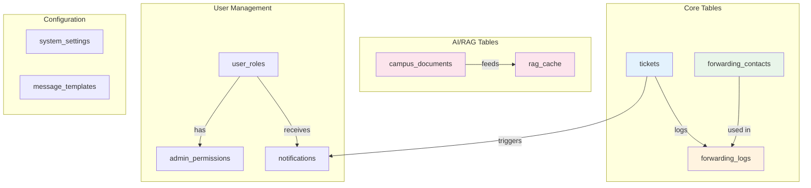
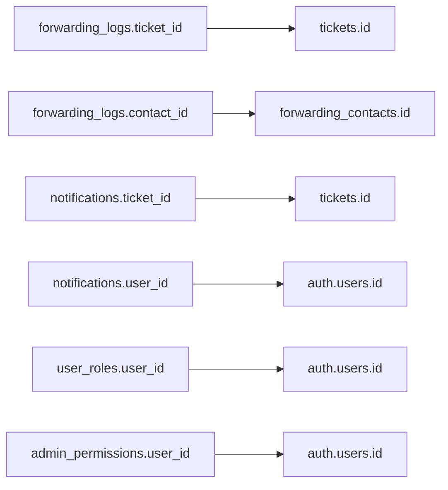

# Diagram Database (ERD)
## Sistem Chatbot Pelayanan Keluhan Kampus

---

## 1. Entity Relationship Diagram (ERD)

```mermaid
erDiagram
    %% Main Tables
    TICKETS {
        uuid id PK "Primary Key"
        text nim "NIM Mahasiswa"
        text kategori "Kategori Keluhan"
        text lokasi "Lokasi Kejadian"
        text subjek "Subjek Keluhan"
        text deskripsi "Deskripsi Lengkap"
        text status "pending/in_progress/forwarded/resolved"
        text assigned_to "Admin yang menangani"
        text notes "Catatan admin"
        text reporter_name "Nama Pelapor (opsional)"
        text reporter_email "Email Pelapor (opsional)"
        boolean is_anonymous "Apakah anonim"
        boolean auto_forwarded "Apakah auto-forward"
        jsonb status_history "Riwayat perubahan status"
        timestamptz waktu "Waktu kejadian"
        timestamptz created_at "Waktu dibuat"
        timestamptz assigned_at "Waktu ditugaskan"
    }

    FORWARDING_CONTACTS {
        uuid id PK "Primary Key"
        text name "Nama Kontak"
        text contact_type "whatsapp/email"
        text contact_value "Nomor/Email"
        text category "Kategori yang ditangani"
        boolean is_active "Status aktif"
        timestamptz created_at "Waktu dibuat"
    }

    FORWARDING_LOGS {
        uuid id PK "Primary Key"
        uuid ticket_id FK "Referensi ke tiket"
        uuid contact_id FK "Referensi ke kontak"
        text contact_name "Nama penerima"
        text contact_type "whatsapp/email"
        text contact_value "Nomor/Email"
        text status "success/failed"
        text error_details "Detail error jika gagal"
        timestamptz sent_at "Waktu pengiriman"
        timestamptz created_at "Waktu dibuat"
    }

    CAMPUS_DOCUMENTS {
        uuid id PK "Primary Key"
        text title "Judul Dokumen"
        text content "Isi Dokumen"
        text file_url "URL File (opsional)"
        vector content_embedding "Vector Embedding"
        jsonb metadata "Metadata tambahan"
        timestamptz created_at "Waktu dibuat"
    }

    RAG_CACHE {
        uuid id PK "Primary Key"
        text question "Pertanyaan user"
        text answer "Jawaban yang di-cache"
        integer documents_used "Jumlah dokumen digunakan"
        integer access_count "Jumlah akses"
        timestamptz created_at "Waktu dibuat"
        timestamptz updated_at "Waktu diupdate"
    }

    SYSTEM_SETTINGS {
        uuid id PK "Primary Key"
        text setting_key "Nama setting"
        text setting_value "Nilai setting"
        timestamptz updated_at "Waktu diupdate"
    }

    USER_ROLES {
        uuid id PK "Primary Key"
        uuid user_id FK "Referensi ke auth.users"
        app_role role "admin/sub_admin"
        timestamptz created_at "Waktu dibuat"
    }

    ADMIN_PERMISSIONS {
        uuid id PK "Primary Key"
        uuid user_id FK "Referensi ke auth.users"
        permission_type permission "Jenis permission"
        timestamptz created_at "Waktu dibuat"
    }

    NOTIFICATIONS {
        uuid id PK "Primary Key"
        uuid user_id FK "Referensi ke auth.users"
        uuid ticket_id FK "Referensi ke tiket"
        text title "Judul notifikasi"
        text message "Isi notifikasi"
        text type "info/warning/error"
        boolean is_read "Sudah dibaca"
        timestamptz created_at "Waktu dibuat"
    }

    MESSAGE_TEMPLATES {
        uuid id PK "Primary Key"
        text name "Nama template"
        text type "whatsapp/email"
        text category "Kategori (opsional)"
        text subject "Subjek (untuk email)"
        text body "Isi pesan"
        jsonb variables "Variabel yang tersedia"
        boolean is_active "Status aktif"
        timestamptz created_at "Waktu dibuat"
        timestamptz updated_at "Waktu diupdate"
    }

    %% Relationships
    TICKETS ||--o{ FORWARDING_LOGS : "has many"
    TICKETS ||--o{ NOTIFICATIONS : "triggers"
    FORWARDING_CONTACTS ||--o{ FORWARDING_LOGS : "used in"
    USER_ROLES ||--o{ ADMIN_PERMISSIONS : "has"
    USER_ROLES ||--o{ NOTIFICATIONS : "receives"
```



---

## 2. Detail Tabel

### 2.1 Tabel `tickets`

Tabel utama untuk menyimpan data keluhan/tiket.

| Kolom | Tipe | Nullable | Default | Deskripsi |
|-------|------|----------|---------|-----------|
| `id` | uuid | No | gen_random_uuid() | Primary key |
| `nim` | text | No | - | NIM mahasiswa pelapor |
| `kategori` | text | No | - | Kategori keluhan |
| `lokasi` | text | No | - | Lokasi kejadian |
| `subjek` | text | No | - | Subjek/ringkasan keluhan |
| `deskripsi` | text | No | - | Deskripsi lengkap |
| `status` | text | No | 'pending' | Status tiket |
| `assigned_to` | text | Yes | - | Admin yang menangani |
| `notes` | text | Yes | - | Catatan dari admin |
| `reporter_name` | text | Yes | - | Nama pelapor (opsional) |
| `reporter_email` | text | Yes | - | Email pelapor (opsional) |
| `is_anonymous` | boolean | Yes | false | Flag anonim |
| `auto_forwarded` | boolean | Yes | false | Flag auto-forward |
| `status_history` | jsonb | Yes | '[]' | Riwayat status |
| `waktu` | timestamptz | No | now() | Waktu kejadian |
| `created_at` | timestamptz | No | now() | Waktu dibuat |
| `assigned_at` | timestamptz | Yes | - | Waktu ditugaskan |

**Status Values:**
- `pending` - Menunggu ditangani
- `in_progress` - Sedang diproses
- `forwarded` - Sudah diteruskan
- `resolved` - Selesai

---

### 2.2 Tabel `forwarding_contacts`

Menyimpan daftar kontak untuk forwarding tiket.

| Kolom | Tipe | Nullable | Default | Deskripsi |
|-------|------|----------|---------|-----------|
| `id` | uuid | No | gen_random_uuid() | Primary key |
| `name` | text | No | - | Nama kontak |
| `contact_type` | text | No | - | 'whatsapp' atau 'email' |
| `contact_value` | text | No | - | Nomor WA atau email |
| `category` | text | No | - | Kategori yang ditangani |
| `is_active` | boolean | No | true | Status aktif |
| `created_at` | timestamptz | No | now() | Waktu dibuat |

---

### 2.3 Tabel `forwarding_logs`

Log pengiriman tiket ke kontak.

| Kolom | Tipe | Nullable | Default | Deskripsi |
|-------|------|----------|---------|-----------|
| `id` | uuid | No | gen_random_uuid() | Primary key |
| `ticket_id` | uuid | Yes | - | FK ke tickets |
| `contact_id` | uuid | Yes | - | FK ke forwarding_contacts |
| `contact_name` | text | No | - | Nama penerima |
| `contact_type` | text | No | - | 'whatsapp' atau 'email' |
| `contact_value` | text | No | - | Nomor/email penerima |
| `status` | text | No | - | 'success' atau 'failed' |
| `error_details` | text | Yes | - | Detail error |
| `sent_at` | timestamptz | No | now() | Waktu pengiriman |
| `created_at` | timestamptz | No | now() | Waktu dibuat |

---

### 2.4 Tabel `campus_documents`

Dokumen kampus untuk sistem RAG.

| Kolom | Tipe | Nullable | Default | Deskripsi |
|-------|------|----------|---------|-----------|
| `id` | uuid | No | gen_random_uuid() | Primary key |
| `title` | text | No | - | Judul dokumen |
| `content` | text | No | - | Isi dokumen |
| `file_url` | text | Yes | - | URL file asli |
| `content_embedding` | vector | Yes | - | Vector embedding |
| `metadata` | jsonb | Yes | - | Metadata tambahan |
| `created_at` | timestamptz | No | now() | Waktu dibuat |

---

### 2.5 Tabel `rag_cache`

Cache untuk jawaban RAG.

| Kolom | Tipe | Nullable | Default | Deskripsi |
|-------|------|----------|---------|-----------|
| `id` | uuid | No | gen_random_uuid() | Primary key |
| `question` | text | No | - | Pertanyaan user |
| `answer` | text | No | - | Jawaban yang di-cache |
| `documents_used` | integer | No | 0 | Jumlah dokumen |
| `access_count` | integer | Yes | 1 | Jumlah akses |
| `created_at` | timestamptz | Yes | now() | Waktu dibuat |
| `updated_at` | timestamptz | Yes | now() | Waktu diupdate |

---

### 2.6 Tabel `system_settings`

Pengaturan sistem.

| Kolom | Tipe | Nullable | Default | Deskripsi |
|-------|------|----------|---------|-----------|
| `id` | uuid | No | gen_random_uuid() | Primary key |
| `setting_key` | text | No | - | Nama setting |
| `setting_value` | text | No | - | Nilai setting |
| `updated_at` | timestamptz | No | now() | Waktu diupdate |

**Setting Keys:**
- `fonnte_api_key` - API key Fonnte
- `resend_api_key` - API key Resend
- `admin_whatsapp` - Nomor WA admin
- `admin_email` - Email admin
- `auto_forward_enabled` - Status auto-forward

---

### 2.7 Tabel `user_roles`

Role pengguna dalam sistem.

| Kolom | Tipe | Nullable | Default | Deskripsi |
|-------|------|----------|---------|-----------|
| `id` | uuid | No | gen_random_uuid() | Primary key |
| `user_id` | uuid | No | - | FK ke auth.users |
| `role` | app_role | No | - | 'admin' atau 'sub_admin' |
| `created_at` | timestamptz | No | now() | Waktu dibuat |

---

## 3. Diagram Relasi Sederhana



---

## 4. Indexes dan Constraints

### 4.1 Primary Keys
Semua tabel menggunakan UUID sebagai primary key dengan default `gen_random_uuid()`.

### 4.2 Foreign Keys



### 4.3 Unique Constraints
- `user_roles.user_id` - UNIQUE (satu user satu role)
- `system_settings.setting_key` - Implicitly unique

---

## 5. Enumerations

### 5.1 app_role
```sql
CREATE TYPE app_role AS ENUM ('admin', 'sub_admin');
```

### 5.2 permission_type
```sql
CREATE TYPE permission_type AS ENUM (
  'manage_tickets',
  'manage_documents', 
  'manage_contacts',
  'manage_templates',
  'view_analytics',
  'manage_settings'
);
```

---

## 6. Database Functions

### 6.1 has_role()
Mengecek apakah user memiliki role tertentu.

```sql
CREATE FUNCTION has_role(user_id uuid, role app_role)
RETURNS boolean AS $$
  SELECT EXISTS (
    SELECT 1 FROM user_roles
    WHERE user_roles.user_id = $1
    AND user_roles.role = $2
  );
$$ LANGUAGE sql SECURITY DEFINER;
```

### 6.2 has_permission()
Mengecek apakah user memiliki permission tertentu.

```sql
CREATE FUNCTION has_permission(user_id uuid, perm permission_type)
RETURNS boolean AS $$
  SELECT EXISTS (
    SELECT 1 FROM admin_permissions
    WHERE admin_permissions.user_id = $1
    AND admin_permissions.permission = $2
  );
$$ LANGUAGE sql SECURITY DEFINER;
```

### 6.3 match_documents()
Semantic search untuk RAG.

```sql
CREATE FUNCTION match_documents(
  query_embedding vector(1536),
  match_threshold float,
  match_count int
)
RETURNS TABLE (
  id uuid,
  title text,
  content text,
  similarity float
) AS $$
  SELECT 
    campus_documents.id,
    campus_documents.title,
    campus_documents.content,
    1 - (campus_documents.content_embedding <=> query_embedding) as similarity
  FROM campus_documents
  WHERE 1 - (campus_documents.content_embedding <=> query_embedding) > match_threshold
  ORDER BY similarity DESC
  LIMIT match_count;
$$ LANGUAGE sql STABLE;
```

---

*Dokumentasi ERD untuk Sistem Chatbot Pelayanan Keluhan Kampus*
