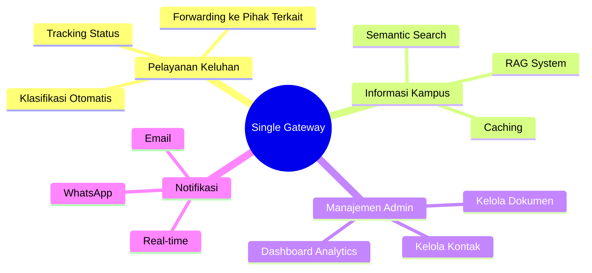
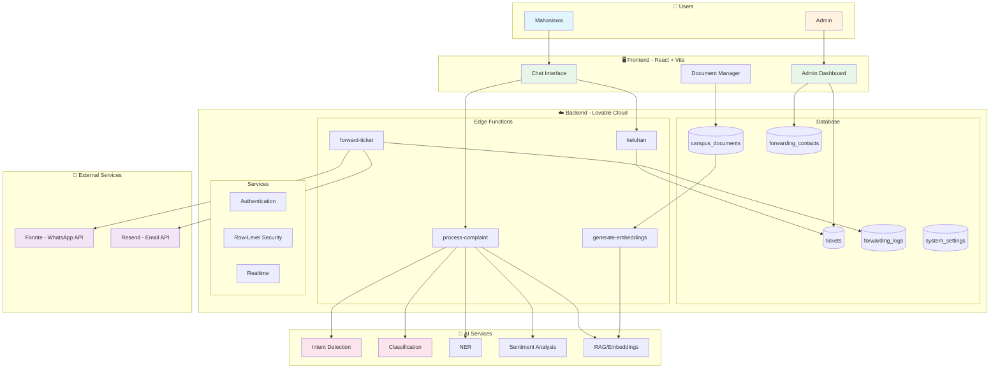
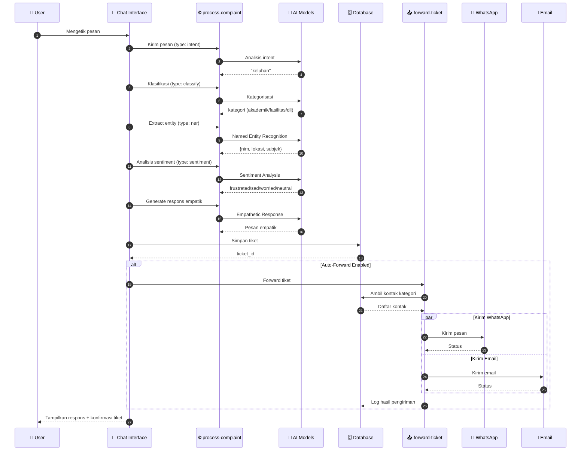
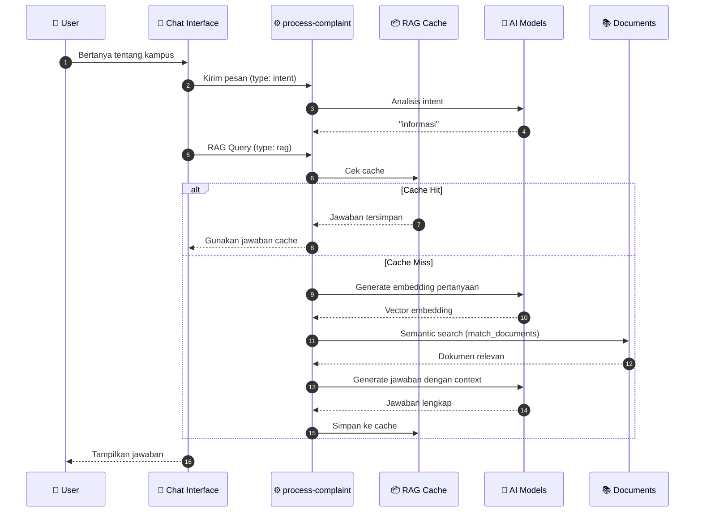
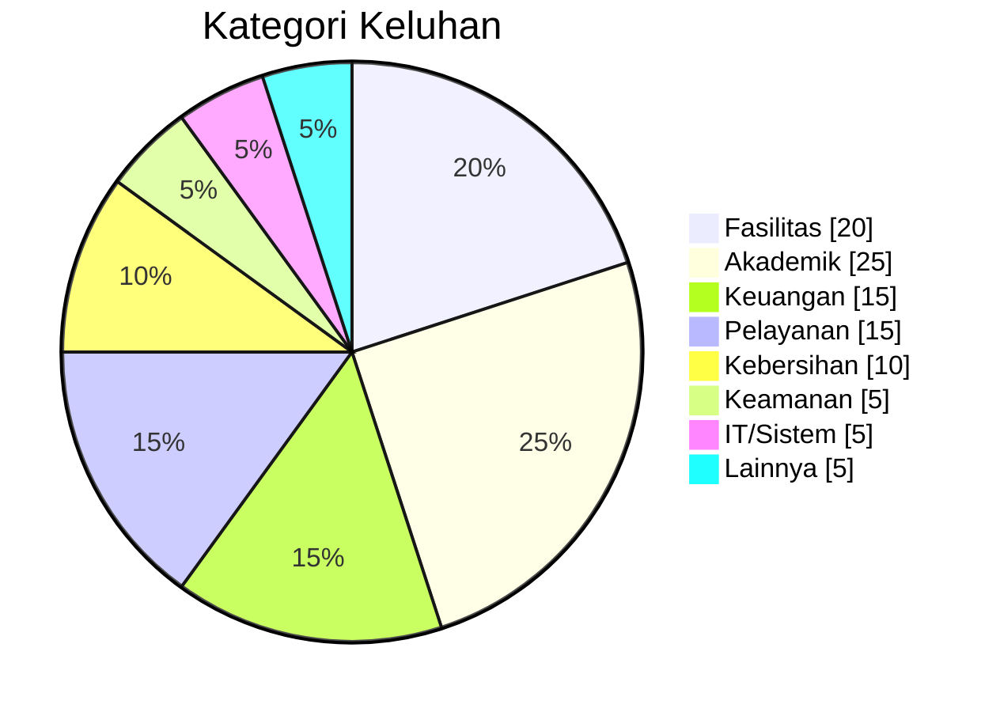
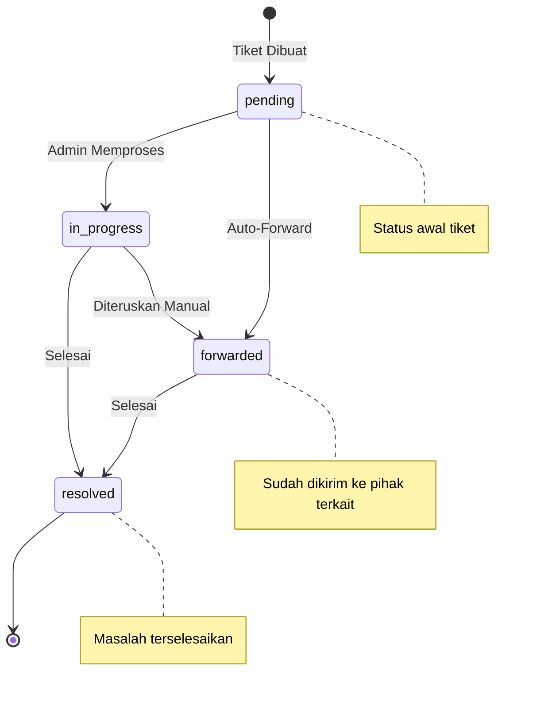
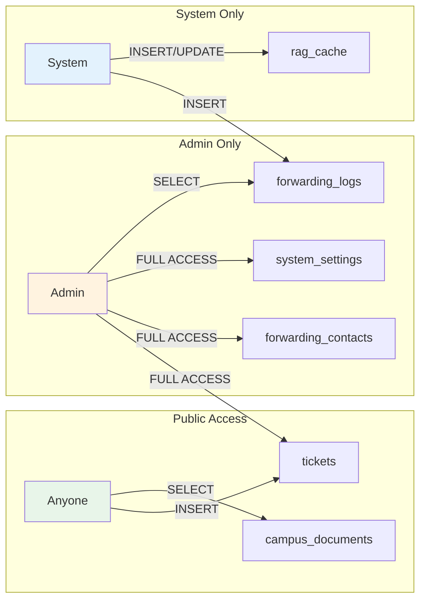
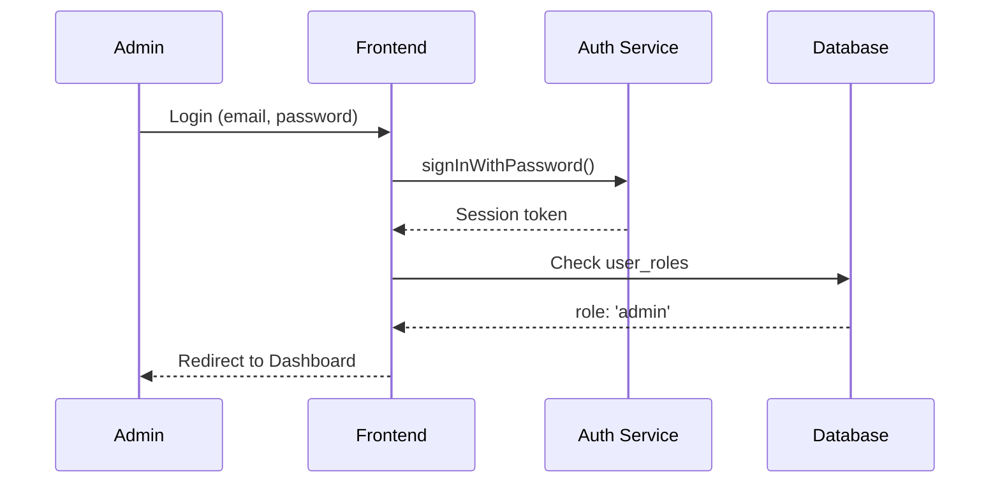
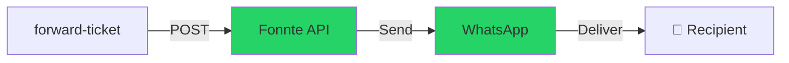
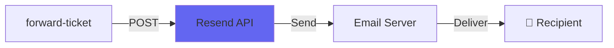

# Dokumentasi Sistem Chatbot Pelayanan Keluhan Kampus
## Single Gateway UIN Alauddin Makassar

---

## 1. Gambaran Umum Sistem

Sistem **Single Gateway** adalah platform chatbot berbasis AI yang dirancang untuk menangani keluhan dan permintaan informasi mahasiswa UIN Alauddin Makassar secara terpusat. Sistem ini mengintegrasikan berbagai teknologi modern untuk memberikan pengalaman pengguna yang optimal.

### 1.1 Tujuan Sistem



### 1.2 Fitur Utama

| No | Fitur | Deskripsi |
|----|-------|-----------|
| 1 | **Intent Detection** | Mendeteksi apakah pesan user adalah keluhan atau permintaan informasi |
| 2 | **Complaint Classification** | Mengklasifikasikan keluhan ke kategori yang sesuai |
| 3 | **Named Entity Recognition (NER)** | Mengekstrak informasi penting (NIM, lokasi, subjek) dari keluhan |
| 4 | **Sentiment Analysis** | Menganalisis sentimen user untuk respons yang empatik |
| 5 | **RAG System** | Menjawab pertanyaan berdasarkan dokumen kampus |
| 6 | **Auto-Forward** | Meneruskan tiket secara otomatis ke pihak terkait |
| 7 | **Real-time Notifications** | Notifikasi real-time untuk admin |
| 8 | **Multi-channel Delivery** | Pengiriman via WhatsApp dan Email |

---

## 2. Arsitektur High-Level



---

## 3. Komponen Utama

### 3.1 Frontend Components

```
src/
├── components/
│   ├── ChatInterface.tsx      # Interface chat utama
│   ├── AdminDashboard.tsx     # Dashboard admin
│   ├── AdminSidebar.tsx       # Navigasi admin
│   ├── ContactManagement.tsx  # Kelola kontak forwarding
│   ├── CampusDocuments.tsx    # Kelola dokumen kampus
│   ├── ForwardingLogs.tsx     # Log pengiriman
│   ├── ForwardingStats.tsx    # Statistik forwarding
│   ├── TicketDisplay.tsx      # Tampilan tiket
│   ├── TicketDetailDialog.tsx # Detail tiket
│   └── MessageTemplates.tsx   # Template pesan
├── pages/
│   ├── Index.tsx              # Halaman utama (chat)
│   ├── AdminAuth.tsx          # Login admin
│   └── NotFound.tsx           # 404 page
└── hooks/
    └── use-toast.ts           # Toast notifications
```

### 3.2 Edge Functions

```
supabase/functions/
├── process-complaint/         # Proses AI (intent, classify, NER, RAG)
├── keluhan/                   # Endpoint submit keluhan
├── forward-ticket/            # Forwarding ke WhatsApp/Email
├── generate-embeddings/       # Generate embeddings untuk RAG
├── parse-pdf-document/        # Parse dokumen PDF
└── check-pending-tickets/     # Cek tiket pending
```

---

## 4. Alur Data Utama

### 4.1 Alur Keluhan (Complaint Flow)



### 4.2 Alur Informasi (RAG Flow)



---

## 5. Kategori Keluhan

Sistem mendukung 8 kategori keluhan utama:



| Kategori | Deskripsi | Contoh |
|----------|-----------|--------|
| **fasilitas** | Masalah infrastruktur fisik | AC rusak, toilet bocor |
| **akademik** | Masalah perkuliahan | Jadwal bentrok, nilai salah |
| **keuangan** | Masalah pembayaran | UKT, beasiswa |
| **pelayanan** | Kualitas layanan staf | Antrian lama, staf tidak ramah |
| **kebersihan** | Kebersihan lingkungan | Sampah menumpuk |
| **keamanan** | Masalah keamanan | Kehilangan barang |
| **it_sistem** | Masalah teknologi | Portal error, WiFi lambat |
| **lainnya** | Kategori umum | Masalah lain-lain |

---

## 6. Status Tiket



---

## 7. Keamanan Sistem

### 7.1 Row-Level Security (RLS)

Setiap tabel memiliki kebijakan RLS yang ketat:



### 7.2 Authentication Flow



---

## 8. Integrasi External

### 8.1 Fonnte (WhatsApp API)



**Endpoint:** `https://api.fonnte.com/send`

### 8.2 Resend (Email API)



**Endpoint:** `https://api.resend.com/emails`

---

## 9. Referensi Dokumen Lain

| Dokumen | Deskripsi |
|---------|-----------|
| [DIAGRAM_DATABASE.md](./DIAGRAM_DATABASE.md) | ERD dan struktur database |
| [ALUR_USER_KELUHAN.md](./ALUR_USER_KELUHAN.md) | Flowchart alur keluhan |
| [ALUR_USER_INFORMASI.md](./ALUR_USER_INFORMASI.md) | Flowchart alur RAG |
| [ALUR_ADMIN.md](./ALUR_ADMIN.md) | Flowchart alur admin |
| [SEQUENCE_DIAGRAM.md](./SEQUENCE_DIAGRAM.md) | Sequence diagram detail |
| [FITUR_KEAMANAN.md](./FITUR_KEAMANAN.md) | Dokumentasi keamanan |
| [API_REFERENCE.md](./API_REFERENCE.md) | Referensi API |

---

*Dokumentasi ini dibuat untuk keperluan skripsi/thesis tentang Sistem Chatbot Pelayanan Keluhan Kampus UIN Alauddin Makassar.*
