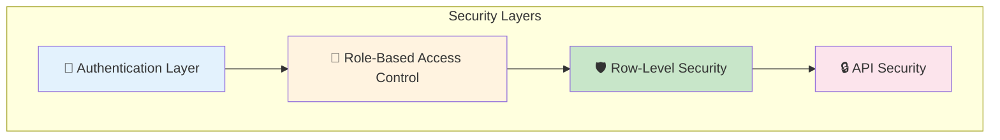
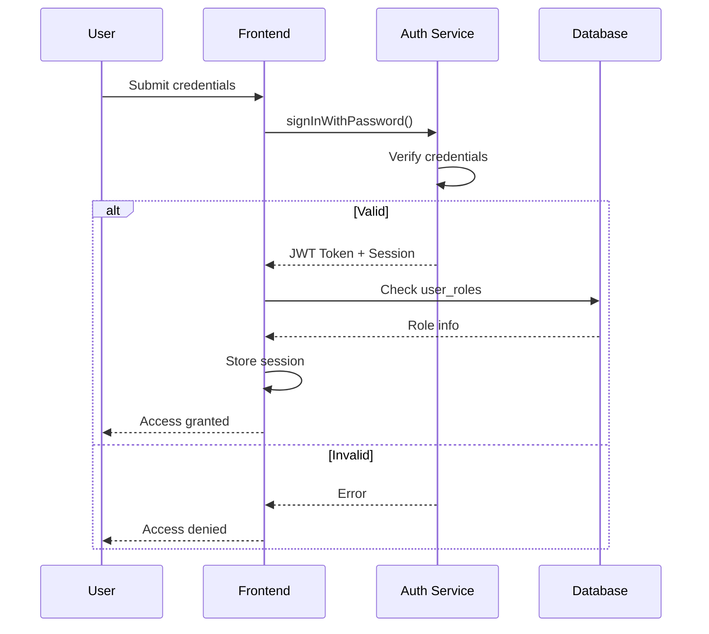
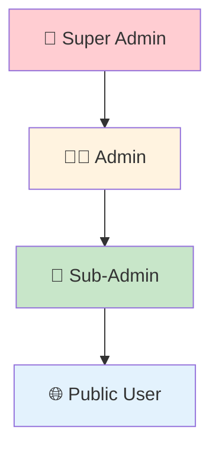
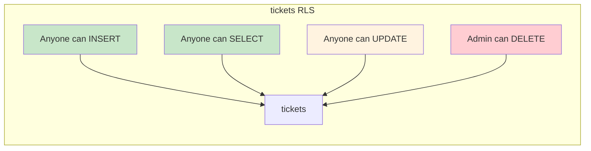
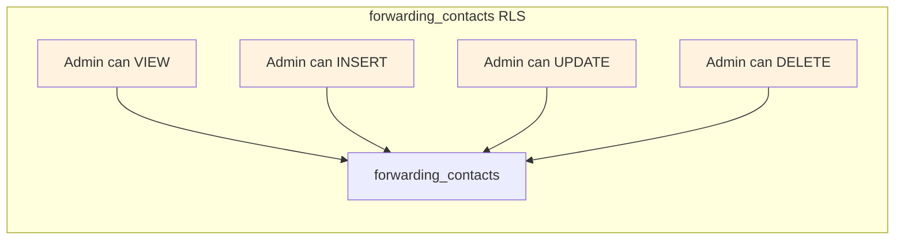
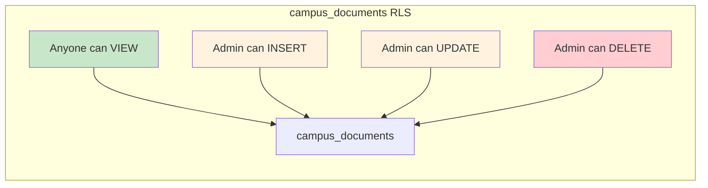
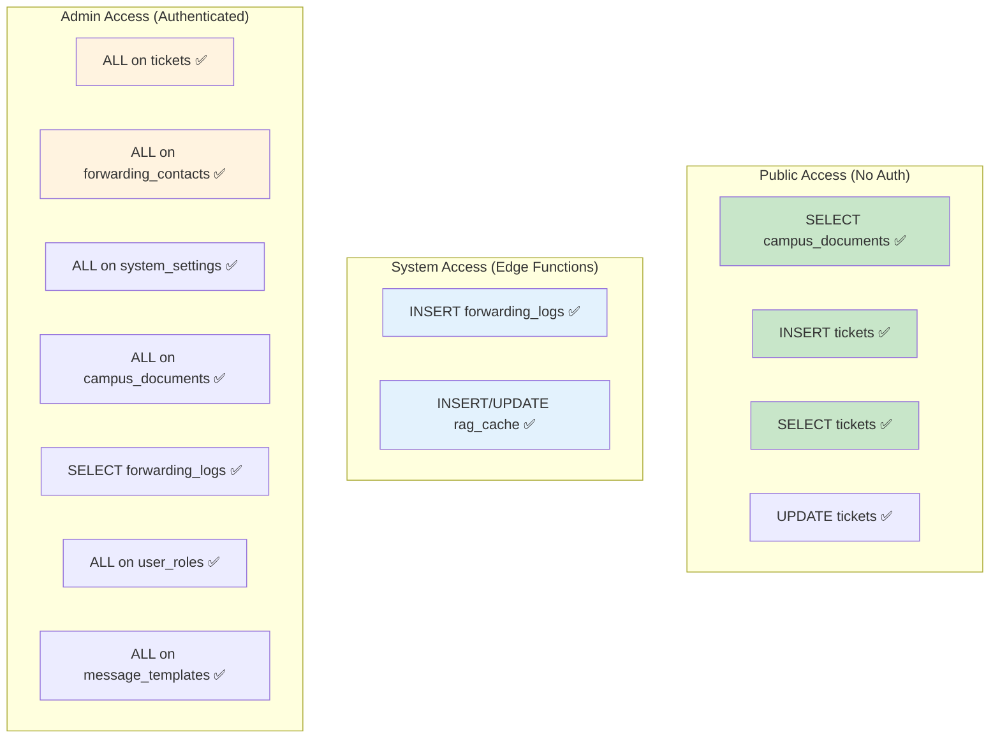
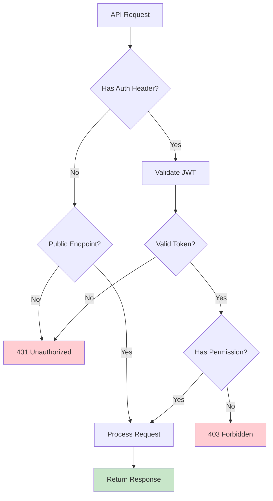
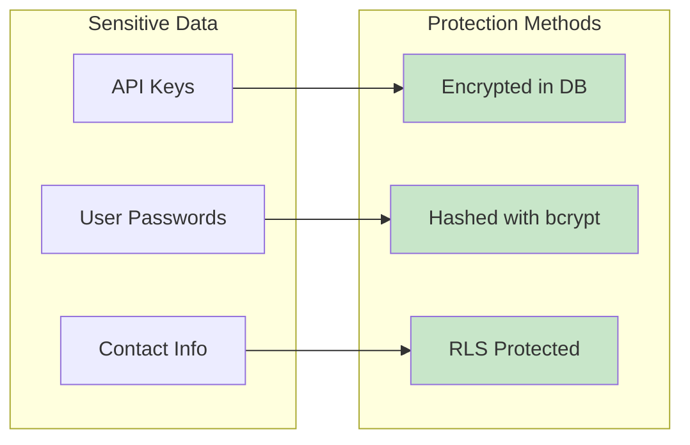
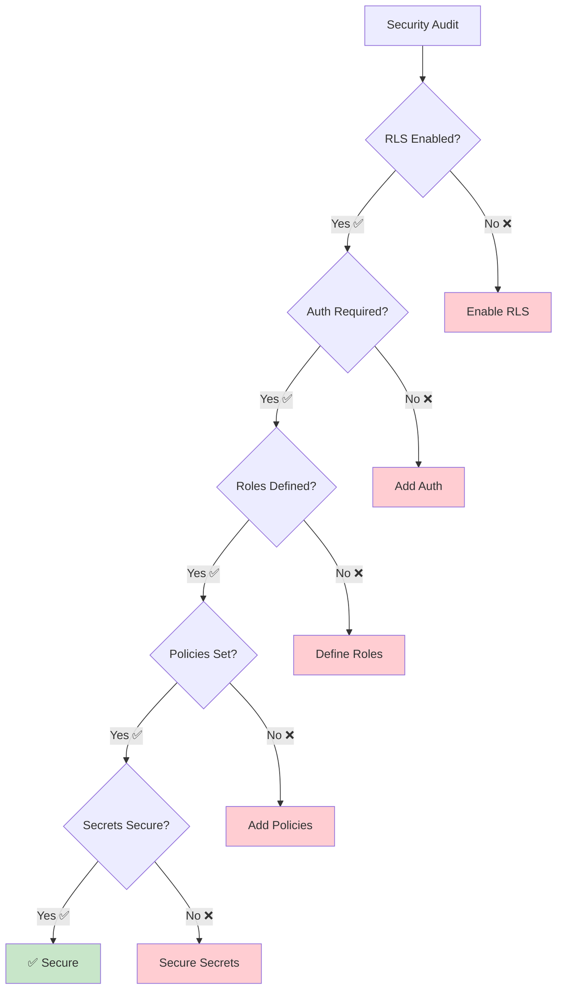

# Fitur Keamanan Sistem
## Row-Level Security, Authentication, dan Access Control

---

## 1. Overview Keamanan



---

## 2. Authentication System

### 2.1 Login Flow



### 2.2 Session Management

```typescript
// Auto-confirm enabled untuk development
// Production: require email verification

interface AuthSession {
  access_token: string;
  refresh_token: string;
  expires_at: number;
  user: {
    id: string;
    email: string;
    role: 'admin' | 'sub_admin';
  }
}
```

---

## 3. Role-Based Access Control (RBAC)

### 3.1 Role Hierarchy



### 3.2 Permission Matrix

| Resource | Public | Sub-Admin | Admin |
|----------|--------|-----------|-------|
| **Tickets** |  |  |  |
| - Create | ✅ | ✅ | ✅ |
| - View Own | ✅ | ✅ | ✅ |
| - View All | ❌ | ✅ | ✅ |
| - Update | ❌ | ✅ | ✅ |
| - Delete | ❌ | ❌ | ✅ |
| **Documents** |  |  |  |
| - View | ✅ | ✅ | ✅ |
| - Create | ❌ | ❌ | ✅ |
| - Update | ❌ | ❌ | ✅ |
| - Delete | ❌ | ❌ | ✅ |
| **Contacts** |  |  |  |
| - View | ❌ | ⚠️ | ✅ |
| - Manage | ❌ | ❌ | ✅ |
| **Settings** |  |  |  |
| - View | ❌ | ❌ | ✅ |
| - Update | ❌ | ❌ | ✅ |
| **Logs** |  |  |  |
| - View | ❌ | ⚠️ | ✅ |

⚠️ = Limited access

### 3.3 Database Functions for RBAC

```sql
-- Check if user has specific role
CREATE OR REPLACE FUNCTION has_role(user_id uuid, role app_role)
RETURNS boolean AS $$
  SELECT EXISTS (
    SELECT 1 FROM user_roles
    WHERE user_roles.user_id = $1
    AND user_roles.role = $2
  );
$$ LANGUAGE sql SECURITY DEFINER;

-- Check if user has specific permission
CREATE OR REPLACE FUNCTION has_permission(user_id uuid, perm permission_type)
RETURNS boolean AS $$
  SELECT EXISTS (
    SELECT 1 FROM admin_permissions
    WHERE admin_permissions.user_id = $1
    AND admin_permissions.permission = $2
  );
$$ LANGUAGE sql SECURITY DEFINER;
```

---

## 4. Row-Level Security (RLS) Policies

### 4.1 Tickets Table



```sql
-- Anyone can create tickets (anonymous submission)
CREATE POLICY "Anyone can create tickets" 
ON public.tickets FOR INSERT 
WITH CHECK (true);

-- Anyone can view tickets (for status checking)
CREATE POLICY "Anyone can view tickets" 
ON public.tickets FOR SELECT 
USING (true);

-- Anyone can update tickets (for status updates)
CREATE POLICY "Anyone can update tickets" 
ON public.tickets FOR UPDATE 
USING (true);

-- Only admins can delete tickets
CREATE POLICY "Admins can delete tickets" 
ON public.tickets FOR DELETE 
USING (has_role(auth.uid(), 'admin'::app_role));
```

### 4.2 Forwarding Contacts Table



```sql
-- Only admins can view contacts
CREATE POLICY "Admins can view contacts" 
ON public.forwarding_contacts FOR SELECT 
USING (has_role(auth.uid(), 'admin'::app_role));

-- Only admins can insert contacts
CREATE POLICY "Admins can insert contacts" 
ON public.forwarding_contacts FOR INSERT 
WITH CHECK (has_role(auth.uid(), 'admin'::app_role));

-- Only admins can update contacts
CREATE POLICY "Admins can update contacts" 
ON public.forwarding_contacts FOR UPDATE 
USING (has_role(auth.uid(), 'admin'::app_role));

-- Only admins can delete contacts
CREATE POLICY "Admins can delete contacts" 
ON public.forwarding_contacts FOR DELETE 
USING (has_role(auth.uid(), 'admin'::app_role));
```

### 4.3 System Settings Table

```sql
-- Only admins can view settings
CREATE POLICY "Admins can view settings" 
ON public.system_settings FOR SELECT 
USING (has_role(auth.uid(), 'admin'::app_role));

-- Only admins can insert settings
CREATE POLICY "Admins can insert settings" 
ON public.system_settings FOR INSERT 
WITH CHECK (has_role(auth.uid(), 'admin'::app_role));

-- Only admins can update settings
CREATE POLICY "Admins can update settings" 
ON public.system_settings FOR UPDATE 
USING (has_role(auth.uid(), 'admin'::app_role));

-- DELETE not allowed on system_settings
```

### 4.4 Campus Documents Table



```sql
-- Anyone can view documents (for RAG)
CREATE POLICY "Anyone can view documents" 
ON public.campus_documents FOR SELECT 
USING (true);

-- Only admins can create documents
CREATE POLICY "Admins can create documents" 
ON public.campus_documents FOR INSERT 
WITH CHECK (has_role(auth.uid(), 'admin'::app_role));

-- Only admins can update documents
CREATE POLICY "Admins can update documents" 
ON public.campus_documents FOR UPDATE 
USING (has_role(auth.uid(), 'admin'::app_role));

-- Only admins can delete documents
CREATE POLICY "Admins can delete documents" 
ON public.campus_documents FOR DELETE 
USING (has_role(auth.uid(), 'admin'::app_role));
```

### 4.5 Forwarding Logs Table

```sql
-- Only admins can view logs
CREATE POLICY "Admins can view forwarding logs" 
ON public.forwarding_logs FOR SELECT 
USING (has_role(auth.uid(), 'admin'::app_role));

-- System can insert logs (from edge functions)
CREATE POLICY "System can insert forwarding logs" 
ON public.forwarding_logs FOR INSERT 
WITH CHECK (true);

-- UPDATE and DELETE not allowed
```

### 4.6 RAG Cache Table

```sql
-- Only admins can view cache
CREATE POLICY "Admins can view rag_cache" 
ON public.rag_cache FOR SELECT 
USING (has_role(auth.uid(), 'admin'::app_role));

-- System can insert to cache
CREATE POLICY "System can insert rag_cache" 
ON public.rag_cache FOR INSERT 
WITH CHECK (true);

-- System can update cache
CREATE POLICY "System can update rag_cache" 
ON public.rag_cache FOR UPDATE 
USING (true);
```

---

## 5. RLS Summary Diagram



---

## 6. API Security

### 6.1 Edge Function Security



### 6.2 CORS Configuration

```typescript
const corsHeaders = {
  'Access-Control-Allow-Origin': '*',
  'Access-Control-Allow-Headers': 'authorization, x-client-info, apikey, content-type',
};

// Handle preflight requests
if (req.method === 'OPTIONS') {
  return new Response(null, { headers: corsHeaders });
}
```

### 6.3 Environment Variables Security

| Variable | Exposure | Storage |
|----------|----------|---------|
| `SUPABASE_URL` | Public | .env (Vite) |
| `SUPABASE_ANON_KEY` | Public | .env (Vite) |
| `SUPABASE_SERVICE_ROLE_KEY` | Secret | Edge Function only |
| `FONNTE_API_KEY` | Secret | Database (encrypted) |
| `RESEND_API_KEY` | Secret | Database (encrypted) |
| `AI_GATEWAY_URL` | Secret | Edge Function only |

---

## 7. Data Protection

### 7.1 Sensitive Data Handling



### 7.2 Password Policy

- Minimum 6 characters (Supabase default)
- Stored as bcrypt hash
- Never transmitted in plain text
- Session tokens expire after configurable time

### 7.3 Anonymous Submission

```typescript
// Tickets can be submitted anonymously
interface AnonymousTicket {
  nim: string;           // Required for tracking
  is_anonymous: true;    // Flag for anonymous
  reporter_name?: null;  // Optional, can be null
  reporter_email?: null; // Optional, can be null
}
```

---

## 8. Audit Trail

### 8.1 Status History Tracking

```typescript
// Every status change is logged
interface StatusHistoryEntry {
  status: string;
  changed_at: string;
  changed_by?: string;
  notes?: string;
}

// Stored in tickets.status_history as JSONB
const status_history = [
  { status: 'pending', changed_at: '2024-01-01T10:00:00Z' },
  { status: 'in_progress', changed_at: '2024-01-01T11:00:00Z', changed_by: 'admin@uin.ac.id' },
  { status: 'resolved', changed_at: '2024-01-02T09:00:00Z', notes: 'AC sudah diperbaiki' }
];
```

### 8.2 Forwarding Logs

```sql
-- Every forward attempt is logged
CREATE TABLE forwarding_logs (
  id uuid PRIMARY KEY DEFAULT gen_random_uuid(),
  ticket_id uuid REFERENCES tickets(id),
  contact_id uuid REFERENCES forwarding_contacts(id),
  contact_name text NOT NULL,
  contact_type text NOT NULL,  -- 'whatsapp' or 'email'
  contact_value text NOT NULL,
  status text NOT NULL,        -- 'success' or 'failed'
  error_details text,          -- Details if failed
  sent_at timestamptz DEFAULT now(),
  created_at timestamptz DEFAULT now()
);
```

---

## 9. Security Best Practices Implemented

### ✅ Implemented

| Practice | Implementation |
|----------|---------------|
| **RLS Enabled** | All tables have RLS enabled |
| **Secure Functions** | Using SECURITY DEFINER |
| **Input Validation** | Client and server-side |
| **CORS Headers** | Properly configured |
| **JWT Validation** | On protected routes |
| **Audit Logging** | Status history, forwarding logs |
| **Environment Variables** | Secrets not in code |
| **Error Handling** | No sensitive data in errors |

### 🔒 Additional Recommendations

| Recommendation | Status |
|---------------|--------|
| Rate limiting | Consider for API endpoints |
| IP whitelisting | For admin access |
| 2FA | For admin accounts |
| Session timeout | Configure shorter timeout |
| SQL injection | Prevented by Supabase client |
| XSS protection | React auto-escapes |

---

## 10. Security Checklist



---

*Dokumentasi Fitur Keamanan untuk Sistem Chatbot Pelayanan Keluhan Kampus*
