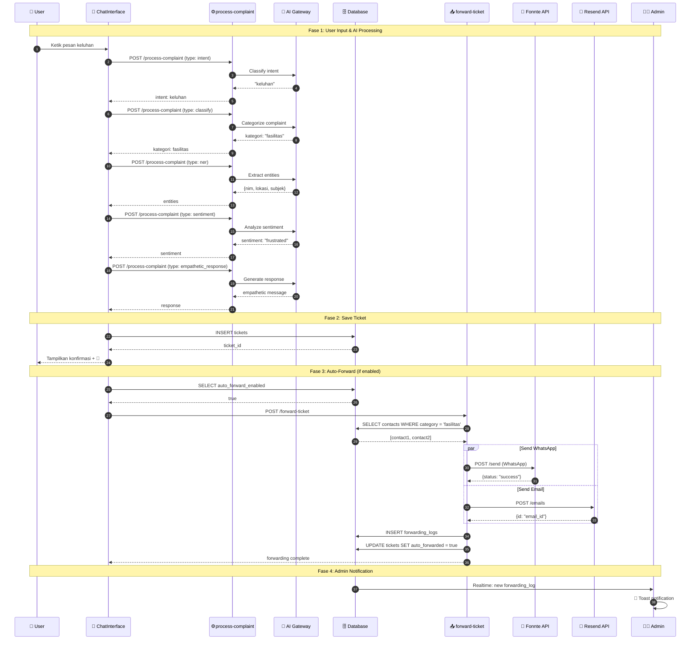
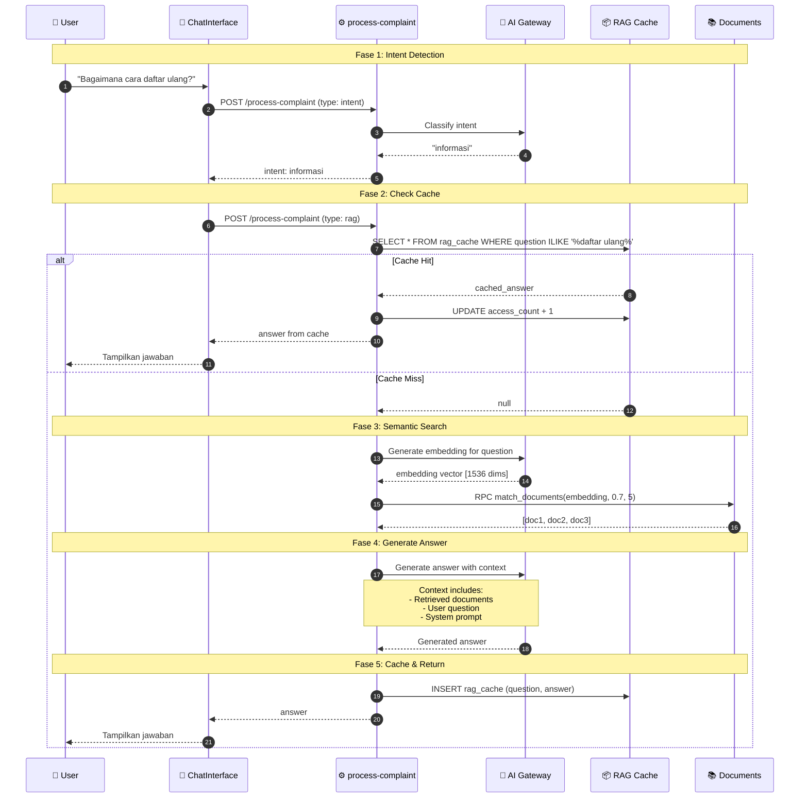
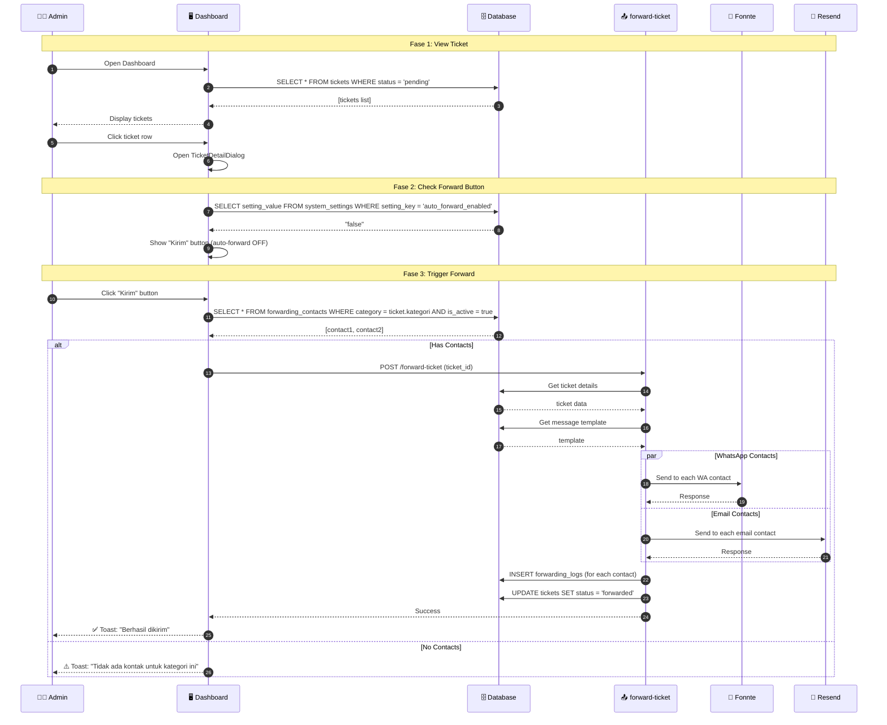
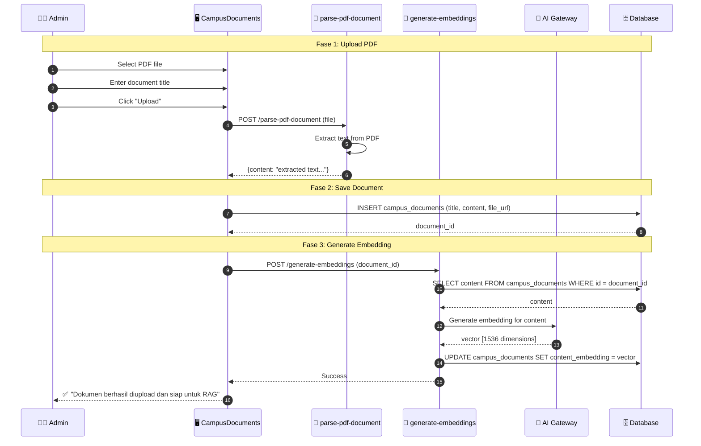
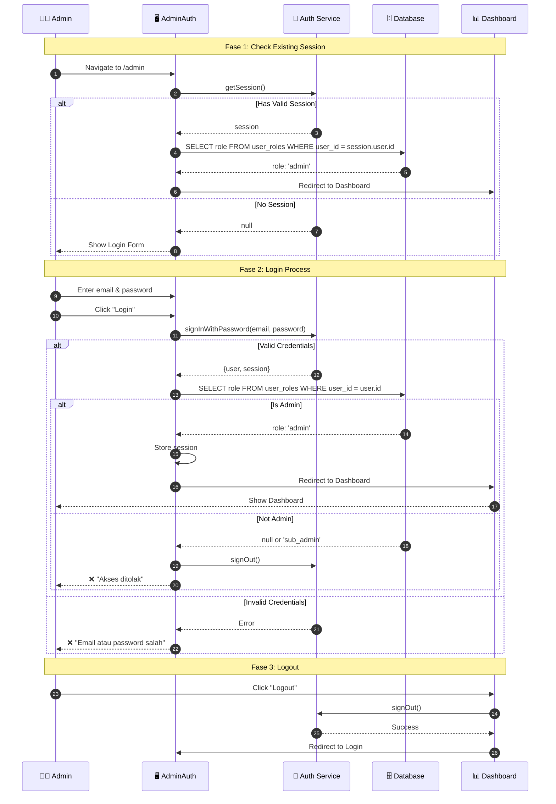
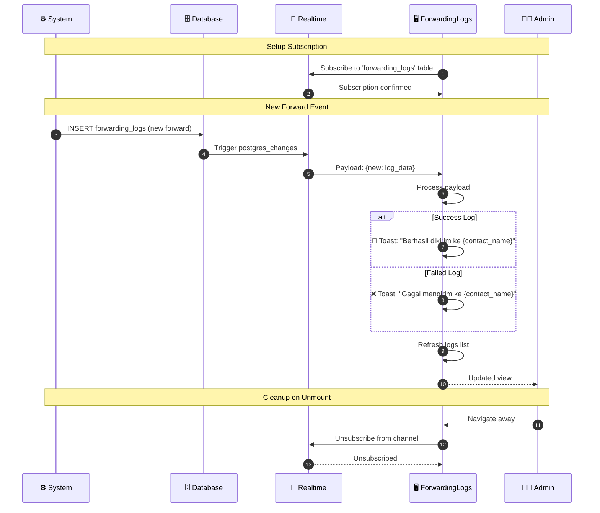
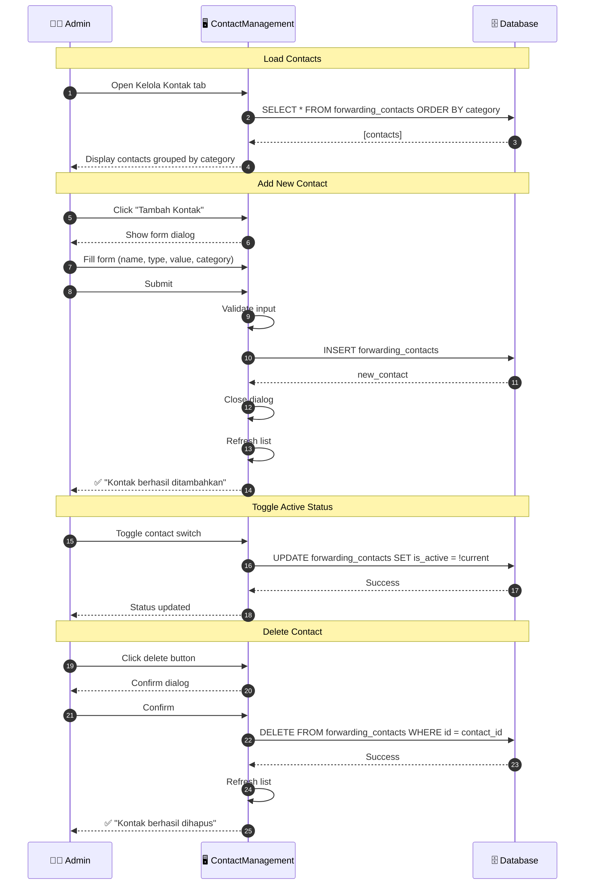
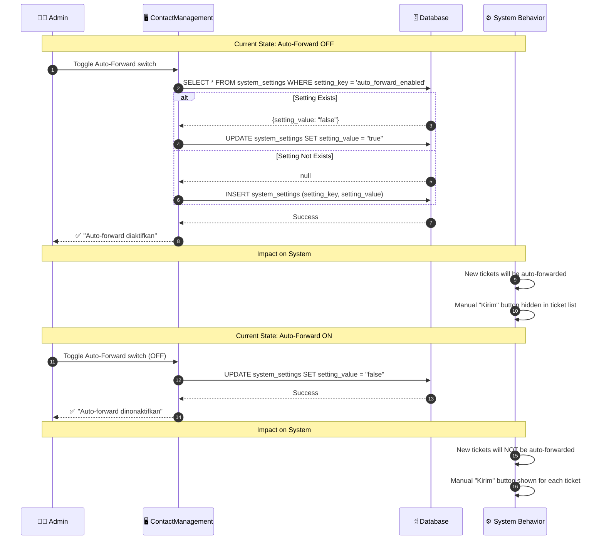
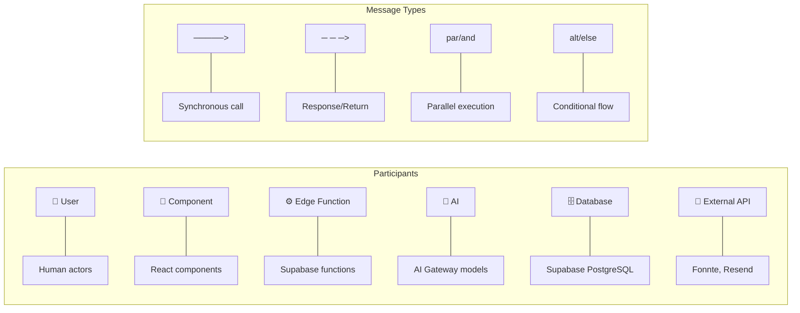

# Sequence Diagram
## Interaksi Detail Antar Komponen Sistem

---

## 1. Sequence Diagram: Submit Keluhan dengan Auto-Forward

---

## 2. Sequence Diagram: RAG Information Retrieval

---

## 3. Sequence Diagram: Manual Forward by Admin

---

## 4. Sequence Diagram: Document Upload & Embedding

---

## 5. Sequence Diagram: Admin Authentication

---

## 6. Sequence Diagram: Real-time Notifications

---

## 7. Sequence Diagram: Contact Management

---

## 8. Sequence Diagram: Toggle Auto-Forward Setting

---

## 9. Legend

---

*Dokumentasi Sequence Diagram untuk Sistem Chatbot Pelayanan Keluhan Kampus*
